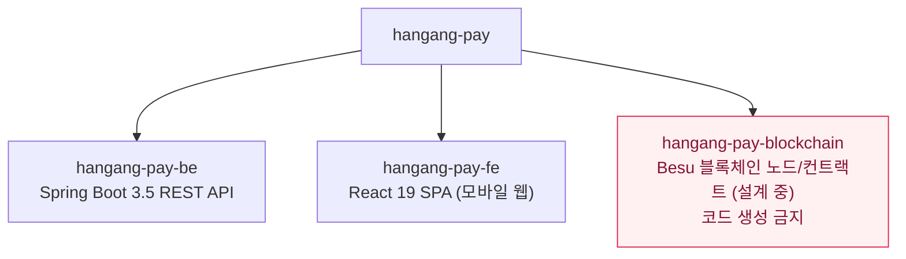
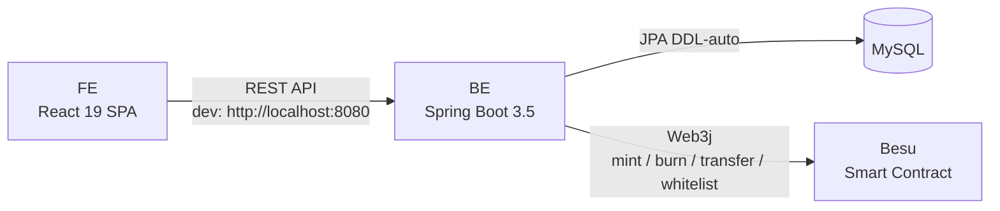
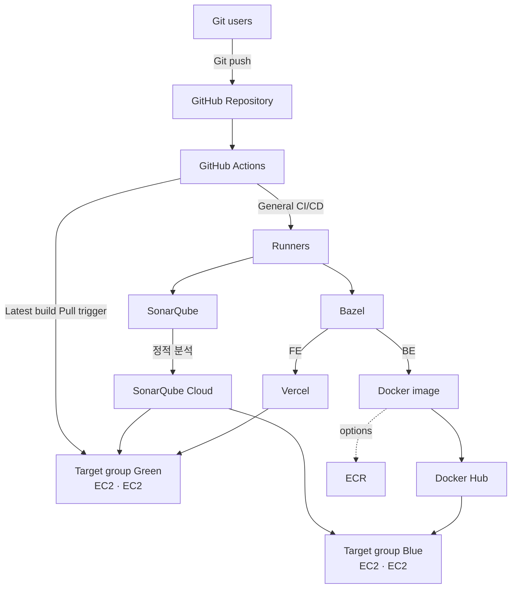
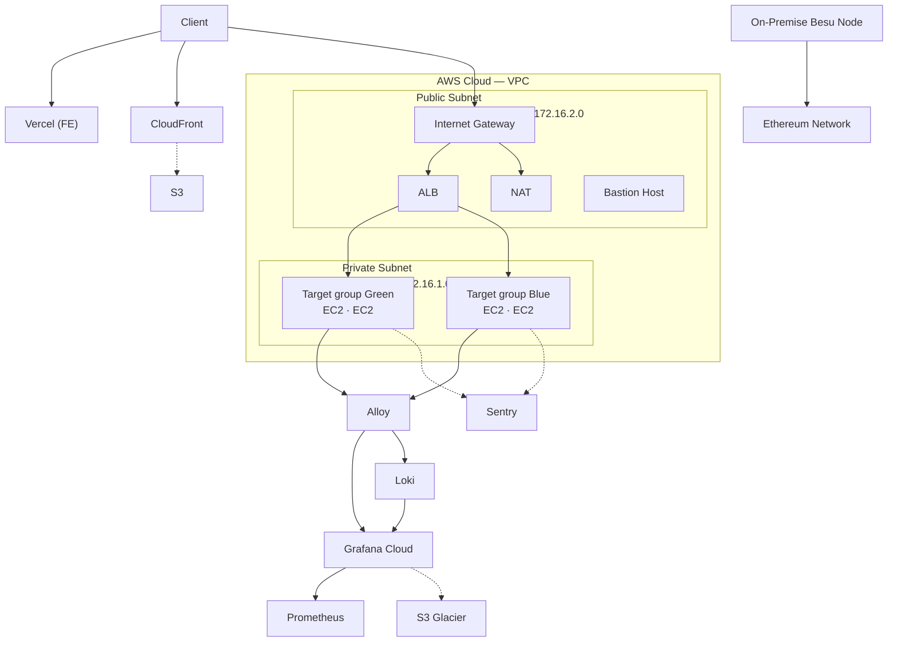

# hangang-pay

성동구 지역화폐 PG(Payment Gateway) 결제 시스템. FIS 아카데미 클라우드 6기 최종 프로젝트.
토큰명: HRC(한강코인). 충전 10% 할인, 환불 조건 최근 충전액 60% 이상 사용.

## Repository Structure



Sub-project relations:


- `hangang-pay-blockchain/`에 코드 생성 금지 (모듈 설계 확정 전)

## Deploy Diagram



> **Todo:** 토큰(블록체인) 관련 빌드 단계 추가 필요 — 사용 툴 미확정

## Operations Diagram

Besu 노드는 온프레미스 가정.



## Branch Convention

브랜치는 반드시 Jira 이슈에서 생성. `main`은 보호 브랜치(직접 push 금지).

네이밍: `{type}/HANGANG-{번호}-{설명}`
```
feat/HANGANG-21-charge-api
fix/HANGANG-31-token-decimal-overflow
chore/HANGANG-15-genesis-config
```

Types: `feat` `fix` `chore` `refactor` `docs` `test` `style`

## Commit Convention

`.gitmessage` 템플릿 사용. `git commit -m` 사용 금지(템플릿 미적용).
팀원 각자 최초 1회 실행: `git config commit.template .gitmessage`

형식:
```
<type>: <제목>

본문 - 무엇을, 왜 변경했는지
```

## PR Convention

제목: `[HANGANG-{번호}] <type>: 작업 내용 한 줄 요약`
템플릿: `.github/PULL_REQUEST_TEMPLATE.md`

## What NOT to Do

- secrets/credentials/.env 커밋 금지 → 로컬 설정은 `application-local.yaml` (gitignored)
- `main`에 직접 push 금지
- BE·FE 변경을 하나의 커밋에 혼용 금지
- `hangang-pay-blockchain/`에 코드 생성 금지
