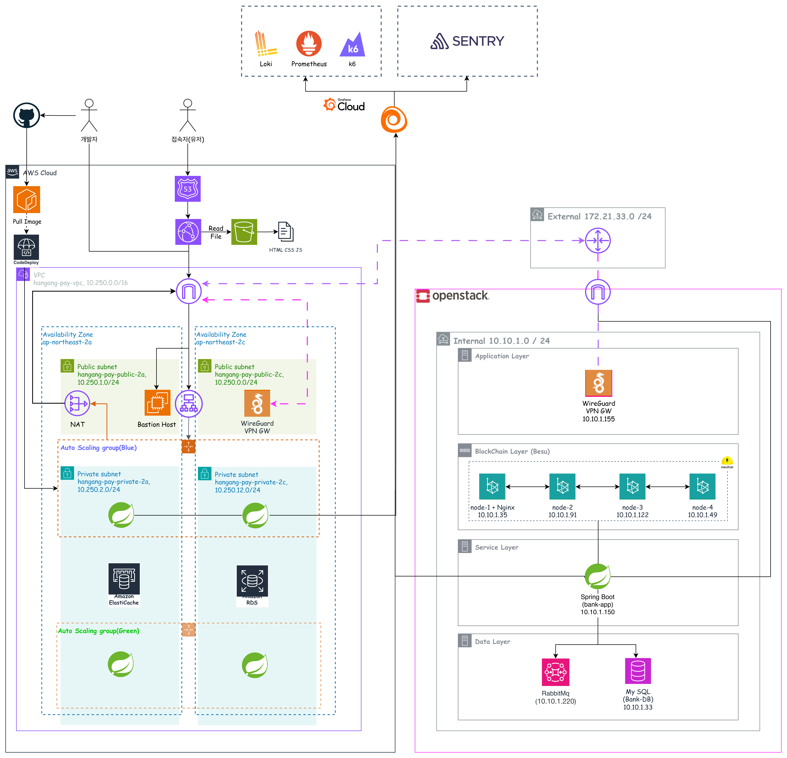
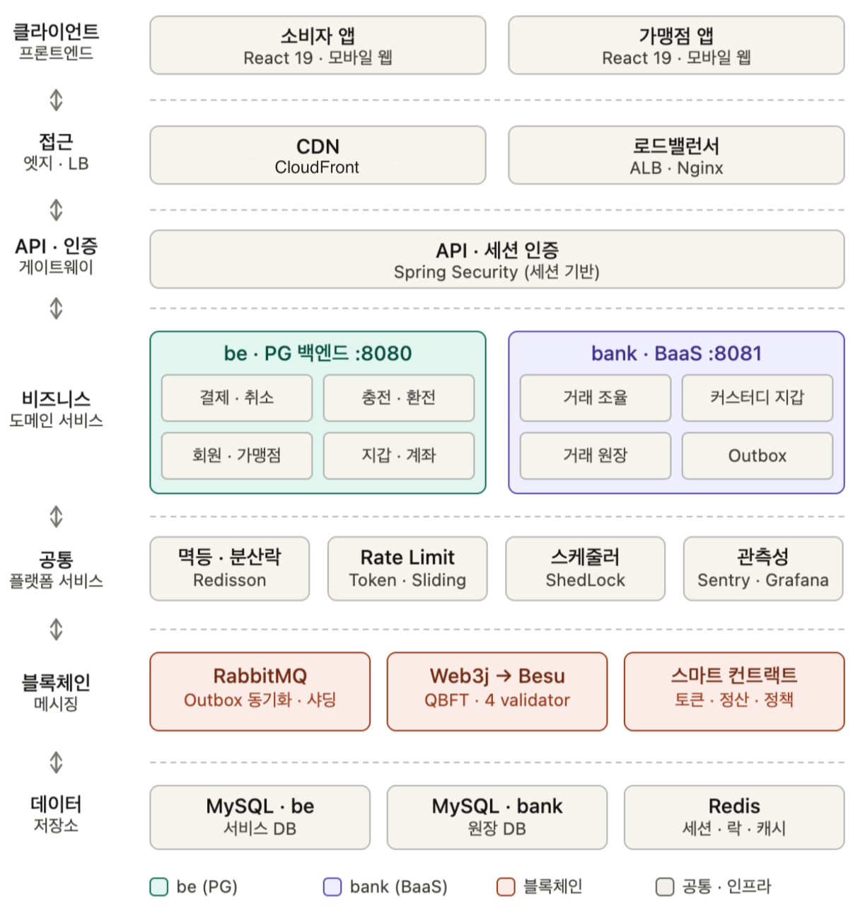
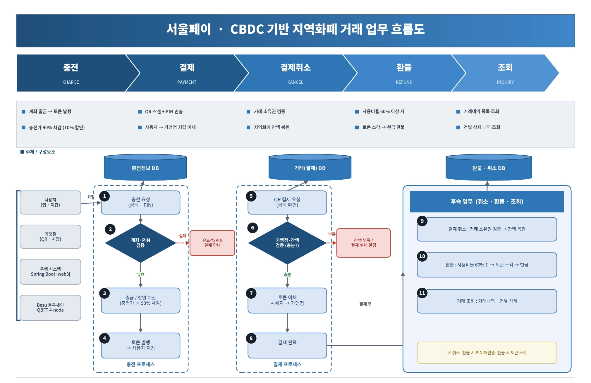
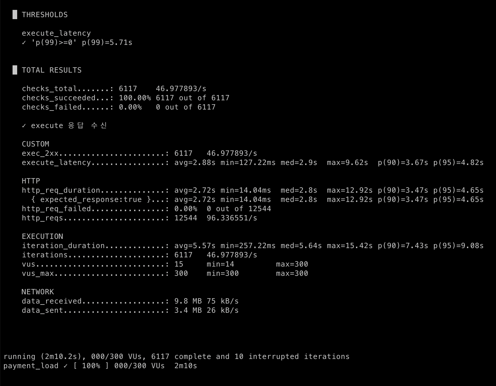

# [우리FISA 6기] 클라우드 서비스 개발 과정 1팀

## 1\. 프로젝트 개요
  * **주제** : CBDC 기반 지역화폐 인프라
  * **프로젝트 기획 배경** : 기존 지역화폐 결제 과정에서 발생하는 정산 지연으로 인한 소상공인의 자금 유동성 문제를 해결하기 위해 기획된 프로젝트입니다.
  * **기술 스택** : JAVA 17, Spring 3.5.14, Web3j 4.12.3, MySQL 8.4.9, Redis, RabbitMQ, HardHat, Solidity


## 2\. 아키텍쳐

### 2-1. 시스템 아키텍쳐
## 시스템 아키텍처

<p align="center">
  
</p>

### 설명
플랫폼 서버는 클라우드 환경에서 WAS 이중화 구조로 구성되어 있으며, Blue / Green 배포 전략을 통해 안정적인 배포가 이루어지는 구조입니다. 은행 서버 및 블록체인 서버는 온프레미스 환경에 위치하며, 플랫폼은 은행 서버의 API를 호출하여 결제 및 정산 관련 기능을 수행합니다. 또한 클라우드 환경의 플랫폼 서버와 온프레미스 환경의 은행 서버 간 통신은 WireGuard VPN Gateway 인스턴스를 통해 연결되며, UDP 500 포트를 이용한 터널링 방식으로 안전한 네트워크 통신을 지원합니다.

### 2-2. 소프트웨어 아키텍처
<p align="center">
  
</p>


### 설명
해당 아키텍처는 사용자 요청을 인증, 비즈니스 서비스, 데이터 저장소 계층으로 분리하여 처리하는 구조입니다. 결제 및 정산 기능은 PG 서비스와 BaaS 서비스로 역할을 구분하였으며, 공통 플랫폼 서비스를 통해 안정적인 서비스 운영을 지원합니다. 또한 블록체인 기반 원장 관리와 스마트 컨트랙트를 활용하여 거래의 신뢰성을 확보하도록 설계되었습니다.

## 3\. 주요 기능 소개

### 3-1. 핵심 기술 구성
- 사용자 지역화폐 충전
- QR 스캔 기반 결제
- 사용자 잔액 환불
- 가맹점 결제 취소
- 거래 내역 조회


### 3-2. 통합 워크플로우 다이어그램
<p align="center">
  
</p>

### 3-3. 세부 기능 소개

## a. 블록체인

**기능 설명**:
은행/블록체인 처리는 BaaS(`hangang-pay-bank`)가 맡고, BE는 `BankClient`로만 호출합니다. <br>
모든 잔액 이동은 Custodial 지갑 (은행이 EC keypair를 만들어 AES/GCM으로 암호화 보관하고, BE에는 `walletAddress`만 넘김)을 기준으로 스마트 컨트랙트에서 처리됩니다.

**우리은행 예금토큰을 지역화폐로 쓰는 구조입니다.** <br>
사용자는 국민, 신한 등 여러 은행 계좌로 충전하지만, 시스템 안에서는 모든 자금이 우리은행 예금토큰 하나로 바뀌어 유통됩니다. <br>
처음에는 은행별 예금토큰을 그대로 쓰는 방안도 봤지만, 그러면 충전한 은행마다 토큰이 달라져 결제/환불/정산에서 매번 토큰 종류를 가려 처리해야 합니다.<br>
(예: 결제 때 어떤 토큰을 먼저 쓸지 기준이 필요)<br>
이 복잡함을 없애기 위해 우리은행 단일 토큰으로 통일했습니다.

### 핵심 코드

```java
public SubmittedBlockchainTx submitPayment(
        String transactionUuid, String from, String to, BigInteger amount) {
    byte[] txKey = keyConverter.toBytes32(transactionUuid); // UUID에서 bytes32 멱등 키 변환
    Function function = new Function(
            "pay",
            List.of(new Bytes32(txKey), new Address(from), // 소비자 지갑
                    new Address(to), new Uint256(amount)),  // 가맹점 지갑, 금액
            List.of());
    return submitContractFunction(ContractType.LOCAL_CURRENCY, DEFAULT_GAS_LIMIT, function); // 서명 후 비동기 제출
}
```

### 코드 링크

- `hangang-pay-bank/domain/blockchain/ContractCallService`
- `hangang-pay-bc/blockchain/contracts/` (CBDCToken, DepositToken, Settlement, LocalCurrencyPolicy)
- `hangang-pay-be/client/bank/BankClient`

## b. 비동기 처리

**기능 설명**:

- **DB 원장 동기 반환**:
    - 은행이 한 트랜잭션 안에서 멱등성 확인 → 가맹점 화이트리스트 확인 → 지갑 비관적 락 후 잔액 이체 → 원장에 기록
    - 사용자는 온체인 확정을 기다리지 않고 바로 결제 성공을 받습니다.
- **Outbox(유실 방지)**:
    - 잔액을 바꾸는 같은 트랜잭션에서 블록체인 원장을 PENDING, 아웃박스를 NEW로 함께 적재합니다.
    - 잔액 변경과 "블록체인에 보낼 일"이 한 커밋으로 묶이므로, 응답 직후 인스턴스가 죽어도 보낼 거래가 남아 유실되지 않습니다.
- **발행(NEW → SENT)**:
    - 별도 주기 배치가 NEW 아웃박스를 모아 메시지 큐로 발행하고 SENT로 바꿉니다.
    - 발행에 실패하면 재시도 횟수를 올리고, 한도를 넘으면 FAILED로 둡니다.
- **온체인 반영(PENDING → SUBMITTED → SUCCESS/FAILED)**:
    - 컨슈머가 메시지를 받아 블록체인에 거래를 제출하고, 제출 직후 거래 해시를 SUBMITTED로 먼저 확정합니다(중복 제출 방지).
    - 이후 영수증을 폴링해 성공이면 SUCCESS, 실패면 FAILED로 최종 확정합니다.
- **순서 보장**:
    - 사용자(지갑)별 순번을 발급해, 같은 지갑의 거래가 온체인에 들어간 순서대로 반영되도록 합니다.
- **실패 처리(DLQ/멱등)**:
    - 일시적 인프라 오류(노드 통신 실패, 영수증 타임아웃)만 재시도 대상으로 DLQ에 재투입합니다.
    - 이미 온체인에 확정된 거래로 판명되면 SUCCESS로, 그 외 오류는 FAILED로 두고 수동 확인합니다.
    - 이미 종료된 거래로 들어온 메시지는 무시합니다.
- **재확인(reconcile)**:
    - 주기 배치가 PENDING/SUBMITTED로 멈춘 거래를 다시 조회해 최종 상태로 맞춥니다.

### 핵심 코드

```solidity
// LocalCurrencyPolicy.pay 가맹점 검증 후 예금토큰 강제 이체 (멱등성은 d-3)
function pay(bytes32 transactionUuid, address from, address to, uint256 amount)
    external onlyOwner returns (bool) {
    if (processedTx[transactionUuid]) revert AlreadyProcessed();
    if (!merchants[to]) revert MerchantNotRegistered();
    processedTx[transactionUuid] = true;
    if (!ILocalDepositToken(depositToken).forceTransfer(from, to, amount)) revert TransferFailed();
    emit Paid(transactionUuid, from, to, amount);
}
```

### 코드 링크

- 컨트랙트: `hangang-pay-bc/blockchain/contracts/` (`LocalCurrencyPolicy.sol`, `Settlement.sol`)
- 호출부: `ContractCallService`, `BankClient`

---

## c. Rate Limit (요청 속도 제한)

**기능 설명**:

결제 API 폭주로 인한 은행 BaaS 과부하와, Execute/Recovery의 단시간 반복 호출(이중 결제/복구 남용)을 막기 위해 구간별로 속도 제한을 적용합니다.

사용자 재시도나 은행 전체 트래픽처럼 순간 버스트가 자연스러운 구간은 **Token Bucket**, 짧은 시간 반복 자체가 위험한 실행/복구 구간은 **Sliding Window**를 씁니다.

### 핵심 코드

**Token Bucket** (결제 시도, 은행 아웃바운드)

```lua
-- TOKEN_BUCKET_SCRIPT --

-- 1. 인자 파싱
local now_ms       = tonumber(ARGV[1])
local capacity     = tonumber(ARGV[2])
local refill_rate  = tonumber(ARGV[3])
local ttl_ms       = tonumber(ARGV[4])

-- 2. 현재 버킷 상태 조회 (없으면 초기화)
local tokens         = redis.call('hget', KEYS[1], 'tokens')
local last_refill_ms = redis.call('hget', KEYS[1], 'last_refill_ms')

tokens = tokens and tonumber(tokens) or capacity
last_refill_ms = last_refill_ms and tonumber(last_refill_ms) or now_ms

-- 3. 경과 시간만큼 토큰 보충 (capacity 초과 불가)
local elapsed_ms = math.max(0, now_ms - last_refill_ms)
tokens = math.min(capacity, tokens + (elapsed_ms * refill_rate))

-- 4. 토큰 소비 후 저장, TTL 갱신
redis.call('hset', KEYS[1], 'tokens', tokens - (tokens >= 1 and 1 or 0), 'last_refill_ms', now_ms)
redis.call('pexpire', KEYS[1], ttl_ms)

-- 5. 토큰 있으면 1(허용), 없으면 0(차단)
return tokens >= 1 and 1 or 0
```

```yaml
# application.yaml
payment:
  rate-limit:
    enabled: true
    intent: # 결제 시도, 사용자별 토큰 버킷
      capacity: 10
      refill-per-minute: 1
    bank-outbound: # 은행 아웃바운드, 전역 토큰 버킷
      capacity: 50
      refill-per-second: 50
```

**Sliding Window** (결제 실행, 복구)

```lua
-- SLIDING WINDOW --

-- 1. 인자 파싱
local now_ms    = tonumber(ARGV[1])
local window_ms = tonumber(ARGV[2])
local limit     = tonumber(ARGV[3])
local member    = ARGV[4]
local ttl_ms    = tonumber(ARGV[5])

-- 2. 윈도우 밖(오래된) 요청 제거
redis.call('zremrangebyscore', KEYS[1], 0, now_ms - window_ms)

-- 3. 현재 윈도우 내 요청 수 확인 후 허용/차단
local count = redis.call('zcard', KEYS[1])
if count < limit then
    redis.call('zadd', KEYS[1], now_ms, member)  -- 현재 요청 기록
    redis.call('pexpire', KEYS[1], ttl_ms)
    return 1  -- 허용
end

-- 4. 한도 초과, 기록 없이 TTL만 갱신
redis.call('pexpire', KEYS[1], ttl_ms)
return 0  -- 차단
```

모든 작업은 한 번의 스크립트 안에서 끝나므로 동시에 들어온 요청들이 경쟁 상태(race condition) 없이 정확히 카운트됩니다.

스크립트가 `1`을 반환하면 통과, `0`이면 `PAYMENT_RATE_LIMIT_EXCEEDED`(HTTP 429) 예외를 던집니다.

한도 및 충전율은 `application.yaml`로 외부화해 두어 부하 테스트 시 `enabled: false`로 우회하거나 천장을 조정할 수 있습니다.

| 구간 | 알고리즘 | Redis 키 | 기본 한도 |
| --- | --- | --- | --- |
| Intent | Token Bucket | `payment:rate:intent:{partyId}` | 용량 10, 분당 1개 충전 |
| Execute | Sliding Window | `payment:rate:execute:{partyId}` | 10분 내 5회 |
| Recovery | Sliding Window | `payment:rate:recovery:{partyId}` | 60초 내 3회 |
| BankOutbound | Token Bucket (전역) | `payment:rate:bank-outbound` | 용량 50, 초당 50개 충전 |

### 코드 링크

- `RedisPaymentRateLimiter`

---

## d. 멱등성 (Idempotency)

### 멱등키(idempotency key)란?

같은 결제 요청이 네트워크 재시도나 중복 클릭으로 여러 번 들어와도 **결과가 한 번 처리한 것과 같도록 보장**하는 기준 값입니다.

한강페이에서는 결제 의도 생성 시 **서버가 발급한 `transactionUuid`** 가 멱등키 역할을 합니다.

클라이언트는 재시도할 때 같은 `transactionUuid`를 그대로 보내고, BE/bank/블록체인 세 계층이 각자 이 키를 기준으로 중복을 걸러냅니다.

한 계층이 누락되더라도 다음 계층이 다시 막는 다중 방어 구조로 구성하였습니다.

---

### d-1. BE: Redis 멱등 저장소 + requestHash

**기능 설명**:

BE는 Redis의 `setIfAbsent`(SET NX) 원자성으로 멱등을 처리합니다.

결제 실행이 시작되면 `transactionUuid`를 키로 `PROCESSING` 상태 레코드를 선점합니다.

동시에 같은 키로 여러 요청이 들어와도 `setIfAbsent`가 성공하는 건 단 하나뿐이라, 그 요청만 신규로 진행하고 나머지는 기존 레코드를 보고 분기합니다.

기존 레코드가 있으면 다음 순서로 판정합니다:

1. **requestHash 불일치**: 같은 UUID인데 요청 내용이 다르면 충돌로 막습니다.
2. **응답 스냅샷 존재**: 이미 완료된 요청이면 저장된 스냅샷을 반환합니다.
3. **FAILED 상태**: 실패로 확정된 거래면 재시도를 거절합니다.
4. **그 외**: 앞선 요청이 처리 중이므로 대기시킵니다.

레코드 TTL은 같은 민감 요청의 중복 실행을 막고 기존 응답을 재현하기 위해 7일로 설정하였습니다.

### 핵심 코드

```java
// RedisPaymentIdempotencyStore.beginExecution, Redis SET NX로 선점 후 상태별 판정
@Override
public PaymentIdempotencyDecision beginExecution(
        String transactionUuid, String requestHash, Long transactionId) {

    String key = key(transactionUuid);

    // 1. PROCESSING 레코드를 원자적으로 선점. 동시 요청 중 하나만 created=true가 된다.
    PaymentIdempotencyRecord newRecord =
            PaymentIdempotencyRecord.processing(transactionUuid, requestHash, transactionId);
    Boolean created =
            redisTemplate.opsForValue().setIfAbsent(key, serialize(newRecord), IDEMPOTENCY_TTL);
    if (Boolean.TRUE.equals(created)) {
        return PaymentIdempotencyDecision.newRequest();   // 신규 → 그대로 진행
    }

    // 2. 이미 키가 있으면 기존 레코드로 판정
    PaymentIdempotencyRecord existing = readRecord(key);

    if (!existing.requestHash().equals(requestHash)) {
        return PaymentIdempotencyDecision.conflict();      // 같은 uuid, 다른 본문 → 충돌
    }
    if (existing.responseSnapshot() != null) {
        return PaymentIdempotencyDecision.returnSnapshot(existing.responseSnapshot()); // 완료 → 응답 재사용
    }
    if (existing.status() == TransactionStatus.FAILED) {
        return PaymentIdempotencyDecision.alreadyFailed(); // 실패 확정 → 재시도 거절
    }
    return PaymentIdempotencyDecision.processing();        // 처리 중 → 대기
}
```

### 코드 링크

- `PaymentIdempotencyStore` (포트) / `RedisPaymentIdempotencyStore` (`beginExecution` / `completeExecution` / `failExecution`)
- `PaymentIdempotencyDecision` (`NEW_REQUEST` / `RETURN_SNAPSHOT` / `PROCESSING` / `CONFLICT` / `ALREADY_FAILED`)
- `RequestHashDigest`, `PaymentRequestHashGenerator`, `CancelRequestHashGenerator`
- cancel/exchange 변형: `RedisCancelIdempotencyStore.beginCancel`, `RedisExchangeIdempotencyStore.beginExecution`

---

### d-2. Bank: DB Unique Constraint

**기능 설명**:

은행은 멱등성의 **마지막 방어선**으로 DB 제약을 사용합니다. BE가 보낸 `transactionUuid`를 거래 원장에 기록할 때 해당 컬럼에 **UNIQUE 제약**을 걸어, 같은 멱등키로 두 번째 INSERT가 들어오면 DB가 무결성 제약 위반을 던집니다.

- BE의 Redis 멱등 저장소(d-1)가 우회되거나 인스턴스 장애로 누락되어도, 실제 잔액을 바꾸는 DB write 직전에서 중복을 원천 차단합니다.
- 충돌이 감지되면 토큰을 다시 옮기지 않고, 이미 처리된 거래로 보아 기존 결과를 그대로 응답합니다.

### 핵심 코드

```java
// 거래 원장 엔티티: transaction_uuid 에 UNIQUE 제약
@Table(uniqueConstraints =
        @UniqueConstraint(name = "uk_ledger_tx_uuid", columnNames = "transaction_uuid"))
public class AccountLedger { /* ... */ }

// 중복 INSERT는 무결성 제약 위반 → 이미 처리된 거래로 간주하고 기존 결과 반환
try {
    ledgerRepository.save(newLedger);
} catch (DataIntegrityViolationException e) {
    return existingResult(transactionUuid);   // 멱등 응답
}
```

### 코드 링크

- `hangang-pay-bank/domain/ledger/account_ledger` 엔티티 (UNIQUE 제약)
- `hangang-pay-bank/domain/transaction/TransactionCommandService` (중복 INSERT 처리)

---

### d-3. Blockchain: processedTx

**기능 설명**:

MQ 재처리, 네트워크 장애, 사용자 중복 클릭 등으로 같은 결제가 여러 번 실행될 수 있습니다. 이를 멱등성의 **최종 계층(온체인)** 에서 막습니다. 컨트랙트는 `transactionUuid`를 키로 `processedTx`에 처리 여부를 기록하고, 결제 진입 시 이미 처리된 키면 `revert` 합니다. 결제 UUID를 온체인에 남겨, 같은 거래의 토큰 이동을 컨트랙트 레벨에서 한 번만 허용합니다.

### 핵심 코드

```solidity
// LocalCurrencyPolicy.pay, 이미 처리된 UUID면 되돌림
if (processedTx[transactionUuid]) {
    revert AlreadyProcessed();
}
// ... 가맹점 검증 → DepositToken.forceTransfer(사용자 → 가맹점) → 이벤트 기록
processedTx[transactionUuid] = true;
```

```text
1차 요청 → 성공
2차 요청 → AlreadyProcessed 예외 (토큰 이동 없음)
```

### 코드 링크

- `hangang-pay-bc/blockchain/contracts/LocalCurrencyPolicy` (`pay` / `processedTx`)

---

## e. 동시성 제어 (Concurrency)

같은 거래의 동시 진입은 BE의 **Redis 분산 락**으로 먼저 차단하고, 잔액을 실제로 바꾸는 은행 쪽 임계 구간은 **DB 비관적 락**으로 보호합니다. 두 락이 계층적으로 역할을 나누고 있습니다.

---

### e-1. 플랫폼: Redis 분산 락 (SET NX)

**기능 설명**:

여러 애플리케이션 인스턴스가 떠 있어도 같은 결제가 동시에 두 번 실행되지 않도록 Redis 분산 락을 사용합니다.

Redis는 NoSQL로 Key와 Value를 갖습니다.

락을 걸 때는 `transactionUuid`를 **Key**로 삼고, 락을 점유할 때 랜덤으로 생성된 UUID를 **Value**로 쌍을 이룹니다.

키를 기준으로 `setIfAbsent`(SET NX) + TTL 30초로 락을 잡고, 성공하면 임계 구간(은행 호출 포함)을 실행한 뒤 `finally`에서 반드시 해제합니다.

해제할 때는 **Lua compare-and-delete** 스크립트를 사용합니다.

락을 걸 때 저장한 자신의 Value(UUID)와 현재 값이 같을 때만 삭제하므로, TTL이 만료된 뒤 다른 요청이 락을 실수로 풀어 버리는 문제를 막습니다.

락 획득에 실패하면 이미 처리 중이라는 의미이므로 `PAYMENT_ALREADY_PROCESSING`(취소는 `CANCEL_ALREADY_PROCESSING`), HTTP 409를 반환합니다.

분산 락(동시 진입 차단)과 멱등 저장소(재요청 식별)가 함께 작동해 중복을 원천 차단합니다.

### 핵심 코드

```java
// RedisPaymentLockManager.withTransactionLock — SET NX로 락 획득, finally에서 안전 해제
public <T> T withTransactionLock(String transactionUuid, Supplier<T> supplier) {
    String key = key(transactionUuid);
    String token = UUID.randomUUID().toString();

    // 1. SET NX로 락 선점. 실패하면 이미 처리 중 → 409
    Boolean acquired = redisTemplate.opsForValue().setIfAbsent(key, token, LOCK_TTL);
    if (!Boolean.TRUE.equals(acquired)) {
        throw new BusinessException(TransactionErrorCode.PAYMENT_ALREADY_PROCESSING);
    }

    // 2. 임계 구간 실행 후 무조건 해제
    try {
        return supplier.get();
    } finally {
        releaseLock(key, token);   // 아래 Lua 스크립트로 자기 토큰일 때만 DEL
    }
}
```

```lua
-- 락 해제: 내가 건 락(토큰 일치)일 때만 삭제 (compare-and-delete)
if redis.call('get', KEYS[1]) == ARGV[1] then
    return redis.call('del', KEYS[1])
end
return 0
```

`TransactionCommandService.executePayment`는 `withTransactionLock`으로, `executeCancel`은 `RedisCancelLockManager.withCancelLock`으로 은행 호출을 감쌉니다.

### 코드 링크

- `PaymentLockManager` (포트) / `RedisPaymentLockManager.withTransactionLock`
- `CancelLockManager` (포트) / `RedisCancelLockManager.withCancelLock`
- 사용처: `TransactionCommandService.executePayment` / `executeCancel`

---

### e-2. 은행: DB 비관적 락 (PESSIMISTIC_WRITE)

**기능 설명**:

은행은 잔액을 실제로 더하고 빼는 구간을 JPA **비관적 락(`@Lock(LockModeType.PESSIMISTIC_WRITE)`)** 으로 보호합니다.

지갑, 계좌 행을 조회하는 순간 `SELECT ... FOR UPDATE`로 잠가, 동시에 들어온 다른 트랜잭션이 같은 잔액을 함께 읽고 각자 갱신해 버리는 문제를 막습니다.

잔액 검증과 차감 및 증가가 하나의 트랜잭션 경계에서 비관적 락을 통해 직렬화하였습니다.

데드락을 피하기 위해 **락 획득 순서도 고정**했습니다.

- 결제: `from` 지갑 → `to` 지갑
- 취소: `to` 지갑 → `from` 지갑 (결제의 역방향)
- 환전: 지갑(`BankWallet`) → 계좌(`BankAccount`)
- 충전: 계좌 → 지갑

추가로 블록체인으로 보내는 거래의 순서도 보장하기 위해, 사용자(지갑 주소)별 시퀀스 번호도 비관적 락으로 잠그고 원자적으로 발급합니다.

### 핵심 코드

```java
@Lock(LockModeType.PESSIMISTIC_WRITE)
@Query("SELECT w FROM BankWallet w WHERE w.walletAddress = :walletAddress")
Optional<BankWallet> findByWalletAddressWithLock(@Param("walletAddress") String walletAddress);
```

```sql
SELECT *
FROM bank_wallet
WHERE wallet_address = ?
FOR UPDATE
```

### 코드 링크

- `hangang-pay-bank/domain/wallet/BankWalletRepository` (`findByWalletAddressWithLock`)
- `hangang-pay-bank/domain/transaction/TransactionCommandService`

---

## 테스트 결과

<p align="center">
  
</p>

VU 300 기준으로 하나의 가맹점에 결제 요청을 하는 시나리오를 구성해보았습니다.

- **p(99) = 5.71s**
- **checks_total.......: 6117    46.977893/s**
- **checks_succeeded...: 100.00%   6117 out of 6117**
- **checks_failed......: 0.00%   0 out of 6117**

라는 객관적인 수치를 바탕으로 모든 거래가 누락되지 않고 성공적으로 결제되는 것을 확인했습니다.

처리율 47/s은 **은행 BaaS 호출**에서 사용되는 **전역 토큰 버킷(Token Bucket)의 허용량 기준이 되었습니다.**
