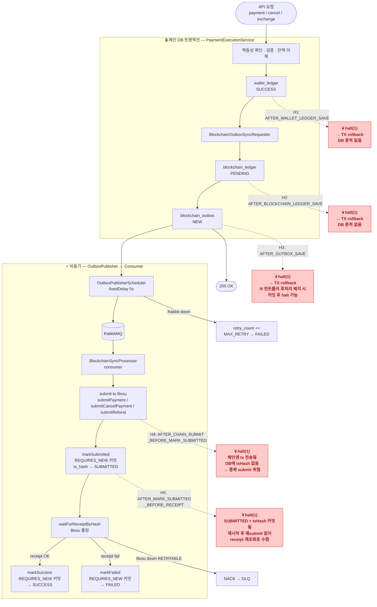
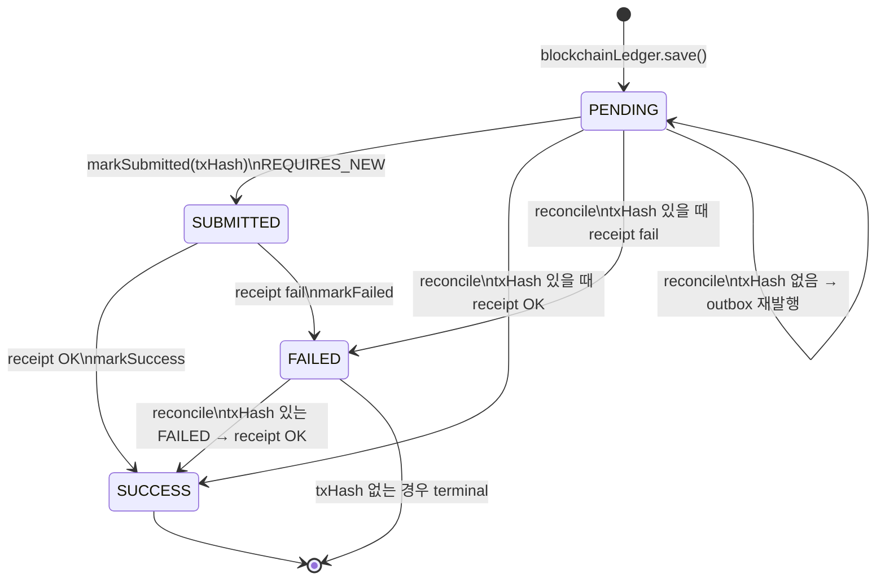
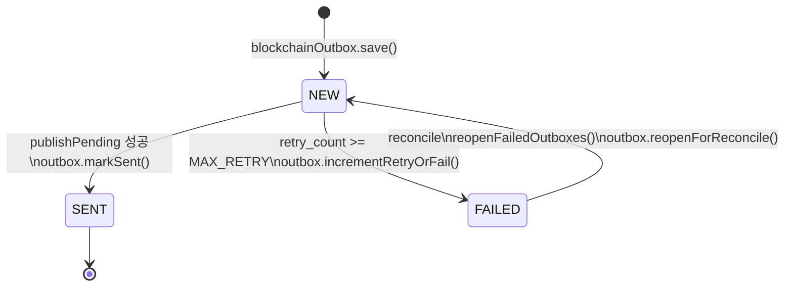
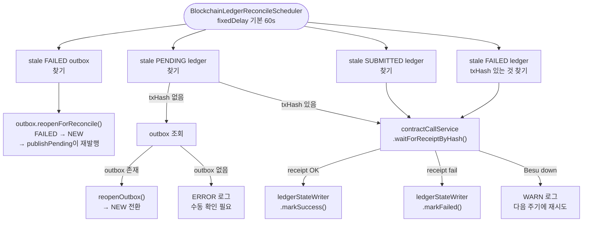

# Bank 예외 시나리오 테스트 Runbook

대상: `hangang-pay-bank` 로컬 환경
목적: Besu / RabbitMQ / Bank 프로세스 장애 시 DB 상태 정합성 검증

---

## 0. 다이어그램

### 0-1. 결제/취소 전체 흐름 + Fault Hook 위치



> **트랜잭션 경계 주의**
> `wallet_ledger` + `blockchain_ledger` + `blockchain_outbox` 저장은 **모두 같은 TX**에서 커밋된다.
> H1 · H2 · H3를 해당 서비스 내부에 배치하면 `halt(1)` 시 커넥션 단절 → MySQL 롤백 → DB 흔적 없음.
> "outbox NEW 남음" 상태(K-4)를 재현하려면 H3를 **컨트롤러 레이어** (TX 커밋 이후) 에 배치해야 한다.
> H4 · H5는 `BlockchainSyncProcessor` 내 REQUIRES_NEW 경계 사이 → 각각 독립 커밋 후 halt 재현 가능.

---

### 0-2. blockchain_ledger 상태 전이



---

### 0-3. blockchain_outbox 상태 전이



---

### 0-4. Reconcile 복구 흐름 (`BlockchainLedgerReconcileScheduler`)



---

## 1. 사전 준비

### 1-1. 인프라 기동

```bash
# Besu 네트워크
cd hangang-pay-bc/network
docker compose up -d

# RabbitMQ
docker run -d --name hp-rabbit \
  -p 5672:5672 -p 15672:15672 \
  rabbitmq:3-management

# Bank 서버
cd hangang-pay-bank
./gradlew bootRun --args='--spring.profiles.active=local'
```

### 1-2. 기동 확인

```bash
curl http://localhost:8081/actuator/health
docker ps --format '{{.Names}}\t{{.Status}}'
# besu-node1 ~ node4, hp-rabbit 모두 Up 확인
```

Rabbit UI: http://localhost:15672 (`guest` / `guest`)

Besu RPC 포트:

| 노드 | RPC 포트 |
|------|---------|
| besu-node1 | 8545 |
| besu-node2 | 8547 |
| besu-node3 | 8549 |
| besu-node4 | 8551 |

### 1-3. Fault Hook 구현 (fault 시나리오 전 필수)

`hangang-pay-bank/src/main/java/.../global/fault/FaultHookService.java` 로 추가:

```java
@Component
@Profile("local")
@RequiredArgsConstructor
public class FaultHookService {
    @Value("${fault.hook.point:}")
    private String point;

    public void hit(String currentPoint) {
        if (currentPoint.equals(point)) {
            log.warn("[fault-hook] HIT point={}. halt(1) 실행", currentPoint);
            Runtime.getRuntime().halt(1);  // throw 금지 — rollback 없는 즉사 재현
        }
    }
}
```

각 서비스에 `FaultHookService` 주입 후 아래 hook point 위치에 `faultHook.hit("POINT_NAME")` 삽입:

| Hook Point | 삽입 위치 | 파일 |
|-----------|----------|------|
| `AFTER_WALLET_LEDGER_SAVE` | `saveSuccessWalletLedgers()` 직후, `syncRequester.request()` 직전 | `PaymentExecutionService` |
| `AFTER_BLOCKCHAIN_LEDGER_SAVE` | `blockchainLedgerRepository.save()` 직후, `blockchainOutboxRepository.save()` 직전 | `BlockchainOutboxSyncRequester` |
| `AFTER_OUTBOX_SAVE` | `blockchainOutboxRepository.save()` 직후 (return 직전) | `BlockchainOutboxSyncRequester` |
| `AFTER_CHAIN_SUBMIT_BEFORE_MARK_SUBMITTED` | `contractCallService.submitPayment/submitCancelPayment/submitRefund()` 직후, `ledgerStateWriter.markSubmitted()` 직전 | `BlockchainSyncProcessor` |
| `AFTER_MARK_SUBMITTED_BEFORE_RECEIPT` | `ledgerStateWriter.markSubmitted()` 직후, `contractCallService.waitForReceiptByHash()` 직전 | `BlockchainSyncProcessor` |

Fault hook 활성화 실행:

```bash
./gradlew bootRun \
  --args='--spring.profiles.active=local --fault.hook.point=AFTER_OUTBOX_SAVE'
```

---

## 2. 공통 curl / SQL

### curl 템플릿

```bash
# 결제
UUID=$(uuidgen | tr '[:upper:]' '[:lower:]')
curl -X POST http://localhost:8081/api/v1/transactions/payment \
  -H 'Content-Type: application/json' \
  -d "{\"transactionUuid\":\"$UUID\",\"fromWalletAddress\":\"0xUSER\",\"toWalletAddress\":\"0xMERCHANT\",\"amount\":100}"

# 취소
CANCEL_UUID=$(uuidgen | tr '[:upper:]' '[:lower:]')
curl -X POST http://localhost:8081/api/v1/transactions/cancel \
  -H 'Content-Type: application/json' \
  -d "{\"transactionUuid\":\"$CANCEL_UUID\",\"originalTransactionUuid\":\"$UUID\",\"fromWalletAddress\":\"0xMERCHANT\",\"toWalletAddress\":\"0xUSER\",\"amount\":100}"

# 환전 (토큰→현금)
UUID=$(uuidgen | tr '[:upper:]' '[:lower:]')
curl -X POST http://localhost:8081/api/v1/transactions/exchange \
  -H 'Content-Type: application/json' \
  -d "{\"transactionUuid\":\"$UUID\",\"institutionId\":2,\"walletAddress\":\"0xUSER\",\"accountNumber\":\"1002123456789\",\"amount\":100}"

# 충전 (현금→토큰)
UUID=$(uuidgen | tr '[:upper:]' '[:lower:]')
curl -X POST http://localhost:8081/api/v1/transactions/charge \
  -H 'Content-Type: application/json' \
  -d "{\"transactionUuid\":\"$UUID\",\"institutionId\":2,\"accountNumber\":\"1002123456789\",\"walletAddress\":\"0xUSER\",\"amount\":9000,\"mintAmount\":10000}"

# 상태 조회
curl http://localhost:8081/api/v1/transactions/$UUID/status
```

### 확인 SQL

```sql
-- blockchain_ledger
SELECT id, idempotent_key, status, tx_hash, confirmed_at, updated_at
FROM blockchain_ledger ORDER BY id DESC LIMIT 10;

-- blockchain_outbox
SELECT id, transaction_uuid, status, retry_count, blockchain_ledger_id, updated_at
FROM blockchain_outbox ORDER BY id DESC LIMIT 10;

-- wallet_ledger
SELECT id, transaction_uuid, status, amount, confirmed_at
FROM wallet_ledger ORDER BY id DESC LIMIT 10;

-- account_ledger
SELECT id, idempotent_key, status, amount, balance_after
FROM account_ledger ORDER BY id DESC LIMIT 10;
```

---

## 3. 기본 성공 시나리오 (모든 fault 테스트 전 먼저 통과 확인)

| # | 항목 | 명령 | 기대 결과 |
|---|------|------|----------|
| S-1 | 결제 정상 | `payment` curl | `wallet_ledger SUCCESS`, `blockchain_outbox SENT`, `blockchain_ledger SUCCESS` |
| S-2 | 취소 정상 | `cancel` curl (S-1 UUID 사용) | `wallet_ledger SUCCESS`, chain 반영 |
| S-3 | 환전 정상 | `exchange` curl | `account_ledger SUCCESS`, `blockchain_ledger SUCCESS` |
| S-4 | 멱등성 — 같은 UUID 재호출 | S-1 UUID로 결제 재호출 | `200 OK` 반환, DB 중복 없음 |

- [x] S-1 통과
- [x] S-2 통과
- [x] S-3 통과
- [x] S-4 통과

---

## 4. Besu 장애 시나리오

### B-1. 요청 전부터 Besu down — 결제

```
유도:  docker stop besu-node1 (또는 전체 노드)
요청:  payment curl
복구:  docker start besu-node1
대기:  reconcile 주기(기본 60s) 이후 확인
```

| 확인 항목 | 기대값 |
|----------|-------|
| `wallet_ledger.status` | `SUCCESS` (DB 선반영) |
| `blockchain_outbox.status` | `NEW` → scheduler 발행 후 `SENT` |
| `blockchain_ledger.status` | `PENDING` → Besu 복구 후 `SUCCESS` 또는 `FAILED` |
| Besu 복구 후 reconcile 수렴 | ledger가 terminal 상태(`SUCCESS`/`FAILED`)로 변경 |

- [x] wallet_ledger 선반영 확인
- [x] outbox scheduler 재발행 확인
- [x] Besu 복구 후 reconcile 수렴 확인

결과: 처음 요청부터 BLOCKCHAIN_RPC_FAILED
-> ensureMerchant()에서 블록체인 요청이 들어가기 때문에... 노드가 죽으면 결제 자체가 불가능함

ensureMerchant 주석 처리 후 결과 확인 중
-> 확인 완료


### B-2. submit 직후 receipt polling 중 Besu down — 결제

```
유도:  payment curl 전송 → 메시지 컨슈머가 submit 시작할 때 docker stop besu-node1
       (타이밍 맞추기 어려우면 AFTER_CHAIN_SUBMIT_BEFORE_MARK_SUBMITTED hook 사용)
복구:  docker start besu-node1
```

| 확인 항목 | 기대값 |
|----------|-------|
| `blockchain_ledger.tx_hash` | 값 존재 (`SUBMITTED` 체크포인트 커밋됨) |
| `blockchain_ledger.status` | `SUBMITTED` 유지 중 |
| Besu 복구 후 | reconcile이 txHash로 receipt 재조회, `SUCCESS`/`FAILED` 수렴 |

- [ ] txHash 저장 확인 (재시작 후에도 중복 submit 없음)
- [ ] 복구 후 reconcile 수렴 확인

-> sleep 넣어서 직접 테스트 가능 but
loadbalancing 도입 후 제거할 시나리오
일단 보류

### B-3. 충전 중 Besu down

> 충전은 동기 흐름이라 API 자체가 실패 반환

```
유도:  docker stop besu-node1 → charge curl
```

| 확인 항목 | 기대값 |
|----------|-------|
| API 응답 | 오류 반환 |
| `account_ledger.status` | `FAILED` |
| `wallet_ledger.status` | `FAILED` |
| `blockchain_ledger.status` | `FAILED` |

- [x] API 오류 반환 확인
- [x] 세 ledger 모두 FAILED 확인

### B-4. 환전 중 Besu down

```
유도:  docker stop besu-node1 → exchange curl
복구:  docker start besu-node1
```

| 확인 항목 | 기대값 |
|----------|-------|
| `account_ledger.status` | `SUCCESS` (DB 선반영) |
| `blockchain_ledger.status` | `PENDING` → 복구 후 수렴 |
| 복구 후 reconcile | outbox 재발행 → chain 반영 |

- [x] account_ledger 선반영 확인
- [x] 복구 후 chain 수렴 확인 -> 10분 후 success 확인

5분 지나야 확인할 수 있음...
근데 이것도 besu 장애 시나리오이기 때문에 nginx 붙이면 필요없을 수도?
그리고 노드 전체가 다 죽는 극한의 상황에서는 수동 복구를 해야하지 않을까?
-> 노드 전체가 다 죽는 상황에서도 그냥 얘가 알아서 복구해줌
-> 수동 복구가 필요한 상황은 SUBMITTED + tx가 체인에서 사라진 경우. 즉, txHash는 DB에 있는데 그 tx가 체인에 존재하지 않는 상황 <-- 이거 하나

```bash
# Besu 제어
docker stop besu-node1
docker start besu-node1
docker ps --format '{{.Names}}\t{{.Status}}'
```

---

## 5. RabbitMQ 장애 시나리오

### R-1. Rabbit down 상태에서 결제

```
유도:  docker stop hp-rabbit → payment curl
```

| 확인 항목 | 기대값 |
|----------|-------|
| `wallet_ledger.status` | `SUCCESS` |
| `blockchain_outbox.status` | `NEW` (publish 불가) |
| `blockchain_outbox.retry_count` | scheduler 반복마다 증가 |
| `blockchain_ledger.status` | `PENDING` 유지 |
| chain 반영 | 없음 |

- [ ] wallet_ledger 선반영 확인
- [ ] outbox retry_count 증가 확인

### R-2. Rabbit down 상태에서 outbox 최대 재시도 도달

```
유도:  R-1 상태 유지 → scheduler MAX_RETRY 도달 대기
```

| 확인 항목 | 기대값 |
|----------|-------|
| `blockchain_outbox.status` | `FAILED` |
| `blockchain_outbox.retry_count` | MAX_RETRY 값 |

- [ ] outbox FAILED 전환 확인
- [ ] MAX_RETRY 상수 값 확인 (코드에서 직접 확인)

### R-3. Rabbit 복구 후 reconcile 재발행

```
유도:  R-2 상태에서 docker start hp-rabbit
대기:  reconcile 주기 이후
```

| 확인 항목 | 기대값 |
|----------|-------|
| `blockchain_outbox.status` | `FAILED` → reconcile이 `NEW` 재전환 → `SENT` |
| `blockchain_ledger.status` | `PENDING` → `SUCCESS`/`FAILED` 수렴 |
| Rabbit queue | 메시지 정상 소비 |

- [ ] reconcile의 `reopenFailedOutboxes()` 동작 확인
- [ ] chain 최종 수렴 확인

### R-4. Rabbit 살아있고 Besu만 down

```
유도:  docker stop besu-node1 (Rabbit은 유지) → payment curl
```

| 확인 항목 | 기대값 |
|----------|-------|
| `blockchain_outbox.status` | `SENT` (Rabbit 전달 성공) |
| consumer 측 | RPC 실패로 `RETRYABLE` 예외 → NACK → DLQ 적재 |
| Rabbit DLQ | 메시지 증가 |

- [ ] outbox SENT 확인 (Rabbit 정상)
- [ ] DLQ 메시지 증가 확인 (Rabbit UI http://localhost:15672)

```bash
# Rabbit 제어
docker stop hp-rabbit
docker start hp-rabbit
curl -u guest:guest http://localhost:15672/api/queues
```

---

## 6. Bank 프로세스 kill 시나리오 (Fault Hook 필요)

### K-1. DB 커밋 전 kill

> 재현 어려움 — hook 없이 참고용

```
기대:  전체 rollback, 모든 ledger 없음
확인:  DB에 해당 UUID 없음
```

- [ ] (참고) DB 흔적 없음 확인

### K-2. `AFTER_WALLET_LEDGER_SAVE` hook — 결제 (wallet_ledger만 있고 outbox 없는 상태)

```
hook:  --fault.hook.point=AFTER_WALLET_LEDGER_SAVE
유도:  payment curl → 프로세스 halt
확인:  DB 상태
복구:  hook 없이 재기동, 같은 UUID로 재호출
```

| 확인 항목 | 기대값 |
|----------|-------|
| `wallet_ledger.status` | `SUCCESS` (이미 커밋됨) |
| `blockchain_outbox` | 없음 (커밋 전 halt) |
| `blockchain_ledger` | 없음 |
| 재기동 후 재호출 | 멱등성 분기 — `SUCCESS` 반환, 잔액 선반영 상태 유지 |
| outbox/ledger | 재호출 시에도 생성되는지 확인 |

> 이 상태는 수동 정산이 필요한 불일치 케이스. 재호출 멱등성 처리가 이를 복구하는지 확인.

- [ ] wallet_ledger SUCCESS 확인
- [ ] blockchain_outbox 없음 확인
- [ ] 재기동 후 재호출 → 멱등 응답 확인
- [ ] outbox/ledger 미생성 확인 (멱등 분기에서 생성 여부 정책 확인 필요)

### K-3. `AFTER_BLOCKCHAIN_LEDGER_SAVE` hook — outbox 없이 ledger만 남는 상태

```
hook:  --fault.hook.point=AFTER_BLOCKCHAIN_LEDGER_SAVE
유도:  payment curl → halt
```

| 확인 항목 | 기대값 |
|----------|-------|
| `wallet_ledger.status` | `SUCCESS` |
| `blockchain_ledger.status` | `PENDING`, `tx_hash` 없음 |
| `blockchain_outbox` | 없음 (save 전 halt) |
| 재기동 후 reconcile | `reconcilePendingLedgers()` 실행 — outbox 없으면 에러 로그(`[reconcile] outbox 없음`) |

- [ ] blockchain_ledger PENDING 확인 (outbox 없음)
- [ ] 재기동 후 reconcile 로그 `[reconcile] outbox 없음` 확인
- [ ] 이 케이스의 수동 복구 방법 정의 필요 여부 확인

### K-4. `AFTER_OUTBOX_SAVE` hook — outbox NEW 남은 상태

```
hook:  --fault.hook.point=AFTER_OUTBOX_SAVE
유도:  payment curl → halt
```

| 확인 항목 | 기대값 |
|----------|-------|
| `wallet_ledger.status` | `SUCCESS` |
| `blockchain_ledger.status` | `PENDING` |
| `blockchain_outbox.status` | `NEW` |
| 재기동 후 | scheduler가 `publishPending()` 수행 → `SENT` 전환 → chain 반영 |

- [ ] 재기동 후 outbox NEW → SENT 전환 확인
- [ ] blockchain_ledger 최종 SUCCESS/FAILED 수렴 확인
- [ ] **핵심**: outbox 패턴의 자가 복구 검증 케이스

### K-5. `AFTER_CHAIN_SUBMIT_BEFORE_MARK_SUBMITTED` hook — 가장 위험한 구간

```
hook:  --fault.hook.point=AFTER_CHAIN_SUBMIT_BEFORE_MARK_SUBMITTED
유도:  payment curl → halt
```

| 확인 항목 | 기대값 |
|----------|-------|
| `blockchain_ledger.tx_hash` | `null` (markSubmitted 커밋 안 됨) |
| `blockchain_ledger.status` | `PENDING` |
| chain 상태 | tx는 실제로 전송됨 (Besu에 tx 존재 가능) |
| 재기동 후 | outbox 재발행 → consumer가 `submitPayment` 재호출 |
| 중복 submit 여부 | `ContractCallService`의 멱등성 처리 확인 필요 |

> 체인에는 tx가 갔는데 DB에 txHash가 없는 상태. 재제출 시 중복 처리 여부가 핵심.

- [ ] blockchain_ledger tx_hash null 확인
- [ ] 재기동 후 재제출 발생 확인
- [ ] 중복 tx 발생 여부 확인 (Besu에서 직접 조회 필요)
- [ ] 중복 시 컨트랙트 멱등성 처리 여부 확인

### K-6. `AFTER_MARK_SUBMITTED_BEFORE_RECEIPT` hook

```
hook:  --fault.hook.point=AFTER_MARK_SUBMITTED_BEFORE_RECEIPT
유도:  payment curl → halt
```

| 확인 항목 | 기대값 |
|----------|-------|
| `blockchain_ledger.tx_hash` | 값 존재 |
| `blockchain_ledger.status` | `SUBMITTED` |
| 재기동 후 | `reconcileSubmittedLedgers()` → txHash로 receipt 재조회 |
| 재submit | 없음 (txHash 재사용) |
| 최종 | `SUCCESS`/`FAILED` 수렴 |

- [ ] SUBMITTED + txHash 존재 확인
- [ ] 재기동 후 재submit 없이 receipt 재조회 확인
- [ ] 최종 수렴 확인
- [ ] **핵심**: SUBMITTED 체크포인트 설계의 핵심 케이스

```bash
# Bank 서버 프로세스 제어 (bootRun 방식)
pkill -f 'hangang-pay-bank'
./gradlew bootRun --args='--spring.profiles.active=local'

# 또는 Docker 컨테이너 방식
docker kill -s SIGKILL bank-app
docker start bank-app
```

---

## 7. 멱등성 시나리오

### I-1. 성공 후 같은 UUID 재호출 — 결제

```
유도:  결제 성공 후 동일 UUID로 payment 재호출
```

| 확인 항목 | 기대값 |
|----------|-------|
| API 응답 | `200 OK`, SUCCESS 상태 반환 |
| DB | ledger 중복 생성 없음 |

- [x] 중복 ledger 없음 확인

### I-2. 처리 중(PENDING) 재호출

```
유도:  Rabbit 또는 Besu down 상태에서 결제 → 동일 UUID 재호출
```

| 확인 항목 | 기대값 |
|----------|-------|
| API 응답 | `DUPLICATE_PROCESSING` 오류 |

- [ ] 중복 처리 오류 반환 확인

### I-3. 실패 후 재호출

```
유도:  결제 실패 유도 → 동일 UUID 재호출
```

| 확인 항목 | 기대값 |
|----------|-------|
| API 응답 | `ALREADY_FAILED` 오류 |

- [ ] 이미 실패한 거래 오류 반환 확인

---

## 8. 추천 실행 순서

```
1. [S-1 ~ S-4] 기본 성공 확인 (모두 pass 후 진행)
2. [R-1 → R-3] Rabbit down → 복구 흐름
3. [B-1 → B-2] Besu down → 복구 흐름
4. [K-4] AFTER_OUTBOX_SAVE — outbox 자가 복구 핵심 케이스
5. [K-6] AFTER_MARK_SUBMITTED_BEFORE_RECEIPT — SUBMITTED 체크포인트 검증
6. [K-5] AFTER_CHAIN_SUBMIT_BEFORE_MARK_SUBMITTED — 중복 submit 위험 구간
7. [I-1 ~ I-3] 멱등성 전체
```

> **먼저 해볼 3개**: `R-1`(Rabbit down + payment), `B-1`(Besu down + exchange), `K-4`(AFTER_OUTBOX_SAVE + payment)
> 이 3개만 해도 DB 선반영 / outbox 자가 복구 / chain 비동기 복구 흐름이 거의 다 보입니다.

---

## 9. 로그 확인

```bash
# 서버 로그 (bootRun)
./gradlew bootRun ... 2>&1 | tee bank.log

# 컨테이너 로그
docker logs -f hp-rabbit
docker logs -f besu-node1

# 주요 로그 키워드
grep -E "\[bank\]|\[outbox\]|\[consumer\]|\[reconcile\]|\[fault-hook\]" bank.log
```

---

## 10. 미확인 항목 (테스트 중 확인 필요)

- [ ] `ContractCallService.submitPayment()` 의 멱등성 처리 방식 (K-5 중복 submit 케이스)
- [ ] `BlockchainOutbox.MAX_RETRY` 상수 값
- [ ] `reconcile` 기본 주기 (`blockchain.reconcile.delay-ms` 기본값 60000ms)
- [ ] K-2 시나리오(`AFTER_WALLET_LEDGER_SAVE`)에서 재호출 시 outbox/ledger 생성 정책
- [ ] 환전 FAILED 시 선반영된 `account_ledger` 수동 롤백 절차
