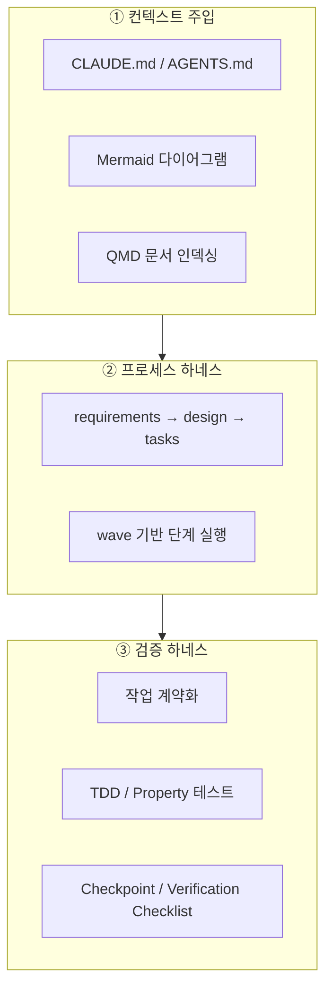
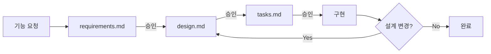

# 하네스 엔지니어링 (Harness Engineering)

> hangang-pay에서 Claude Code 같은 AI 코딩 에이전트를 제대로 부려 쓰려고
> 저장소에 심어둔 컨텍스트·프로세스·검증 장치를 정리했다.

## 왜 하네스인가

LLM 에이전트는 컨텍스트가 모자라면 환각을 내고, 고삐가 없으면 멋대로 코드를 짠다.
하네스는 이 모델을 붙잡아 두는 안전벨트다. 에이전트가 무엇을 알아야 하는지,
어떻게 일해야 하는지, 어디까지 해야 끝난 것인지를 저장소 안에 적어두면
사람이 매번 들여다보지 않아도 비슷한 품질이 나온다.

장치는 세 층이다.

---

## ① 컨텍스트 주입 (Context Injection)

### 단일 원본 + 멀티 에이전트 호환

`AGENTS.md`는 단 한 줄, `@CLAUDE.md`만 담고 있다. 에이전트마다 읽는 진입 파일이 다르지만
(Cursor·Codex는 `AGENTS.md`, Claude Code는 `CLAUDE.md`), 실제 내용은 `CLAUDE.md` 한 곳에만 둔다.
규약이 두 군데로 갈라져 서로 어긋나는 일을 원천적으로 막는 단일 진실 공급원(SSoT) 구조다.

### Mermaid 다이어그램 기반 컨텍스트 압축

저장소 구조, 배포 파이프라인, 운영 인프라(VPC·ALB·Blue/Green·관측 스택)를 전부 Mermaid 다이어그램으로
`CLAUDE.md`에 박아뒀다. 같은 내용을 풀어 쓴 글보다 그래프가 토큰을 덜 먹고,
모듈이 서로 어떻게 엮이는지도 에이전트가 금방 읽어낸다.

### QMD 기반 문서 인덱싱

설계 인사이트·은행 연동·이력서 등 24개 문서를 QMD로 로컬 인덱싱해 뒀다(컬렉션 4개).
문서를 통째로 읽는 대신 BM25 키워드 검색으로 필요한 대목만 꺼내 쓰니 토큰이 덜 든다.

### LLM 행동 규약 + 문서 디렉토리 관리

`CLAUDE.md`에는 브랜치·커밋·PR 컨벤션과 "하지 말아야 할 것" 목록이 명시돼 있다.

- **브랜치**: `HANGANG-{번호}-{설명}`을 쓰고 `main`에 직접 push 하지 않는다.
- **커밋**: `.gitmessage` 템플릿을 강제하고 `git commit -m`을 금지한다.
- **PR**: 제목을 `[HANGANG-{번호}] <type>: 요약` 형식으로 맞춘다.
- **금지사항**: secrets 커밋, BE·FE 혼용 커밋, 블록체인 모듈 코드 생성을 막는다.

여기에 더해 메모리 디렉토리로 세션 간 배경지식을 누적 주입한다.

---

## ② 프로세스 하네스 (Process Harness)

기능을 구현하기 전에 반드시 `requirements → design → tasks` 3단계 문서를 작성하고,
각 단계마다 사용자 승인을 받은 뒤 다음으로 넘어간다. 코드 작성 전에 세 문서가 모두 존재해야 한다.

- **requirements.md**: 무엇을 만들 것인가. Acceptance Criteria는 EARS 표기법(WHEN/WHILE/IF/WHERE/THE … SHALL)으로 검증 가능하게 쓴다.
- **design.md**: 어떻게 만들 것인가. 필수 7섹션 + 선택 11섹션, Correctness Property는 전칭 명제로 작성한다.
- **tasks.md**: 언제·어떤 순서로 만들 것인가. 진행 상황을 추적하는 단일 진실 공급원이다.

### wave 기반 단계 실행

작업은 의존성 그래프의 wave 단위로 쪼갠다. wave 0부터 순서대로 진행하되 같은 wave 안의 작업은 병렬로 처리한다.
phase로 작업 범위를 끊어 한 번에 너무 많은 변경이 섞이지 않도록 한다.

---

## ③ 검증 하네스 (Verification Harness)

### 작업 계약화

각 작업은 단순한 할 일 목록이 아니라 계약(contract)이다. 다음 항목을 명시해 에이전트가 범위를 벗어나지 않게 한다.

| 항목 | 의미 |
|------|------|
| Goal | 이 작업이 달성할 목표 |
| DoD (Definition of Done) | 완료로 인정하는 기준 |
| Module | 건드릴 모듈·파일 범위 |
| Target test | 통과해야 할 테스트 |
| Allowed | 허용된 변경 |
| Forbidden | 금지된 변경 |
| Checkpoints | 중간 검증 지점 |

모든 leaf task는 `_Requirements: REQ-X_`로 추적성을 명시해 요구사항-설계-테스트가 끊김 없이 연결된다.

### TDD 강제 검증

테스트를 먼저 작성하고, Property-based testing으로 edge case를 자동으로 잡아낸다.
각 Property test는 어떤 Correctness Property를 검증하는지 명시한다.

### Checkpoint / Verification Checklist

각 wave가 끝나면 Checkpoint를 통과해야 다음 wave로 넘어간다. 빌드·린트·테스트 통과 같은 실행 가능한 기준으로 구성한다.
구현 완료 전에는 Verification Checklist로 모든 요구사항 구현 여부, Property test 통과 여부, Traceability Matrix 완전성을 확인한다.

---

### AI 선(先)검증 PR 리뷰

리뷰도 하네스의 일부다. `gh` CLI로 PR을 끌어와 AI에게 먼저 훑게 한 뒤,
AI가 짚어준 지점을 사람이 한 번 더 확인하는 2단계로 돌렸다.
AI가 컨벤션 위반·명백한 버그·놓친 예외 처리 같은 기계적인 부분을 먼저 걸러주니
사람은 설계 판단이 필요한 대목에만 집중하면 된다.

효과는 리뷰 시간에서 바로 드러났다. PR 한 건을 처음부터 끝까지 손으로 읽던 시절에는
2시간쯤 걸리던 리뷰가, AI 선검증을 끼우고 나서는 30분 안에 끝난다.

이 흐름 덕에 리뷰 분량 자체를 늘릴 수 있었다. 타인이 올린 PR을 65건 리뷰했고
(전체 213건의 약 30%), 그 과정에서 코드 라인에 직접 단 inline 리뷰 코멘트는 25건이다.
혼자 짠 코드만 보는 게 아니라 팀 코드베이스의 3분의 1을 직접 읽고 의견을 남긴 셈이다.

## 정리

하네스 엔지니어링은 결국 에이전트 자체를 믿는 대신 에이전트를 감싼 구조를 믿겠다는 이야기다.
컨텍스트를 눌러 담아 넣어주고 프로세스를 단계로 끊어두고 완료 기준을 계약으로 못 박아두면,
누가 옆에서 매번 지켜보지 않아도 결과물의 품질이 들쭉날쭉하지 않는다.
