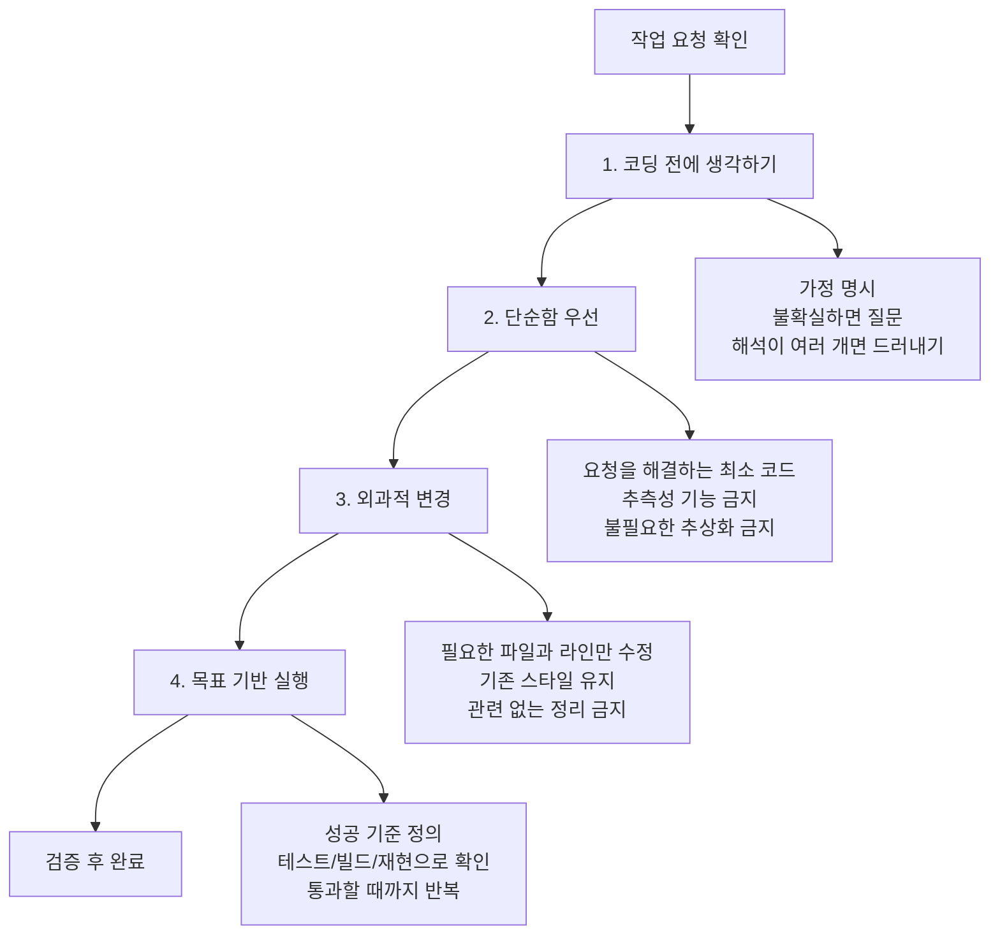
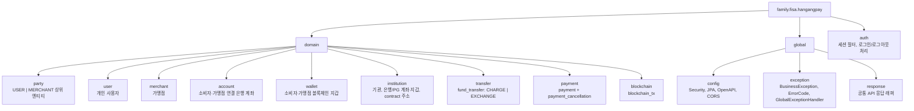
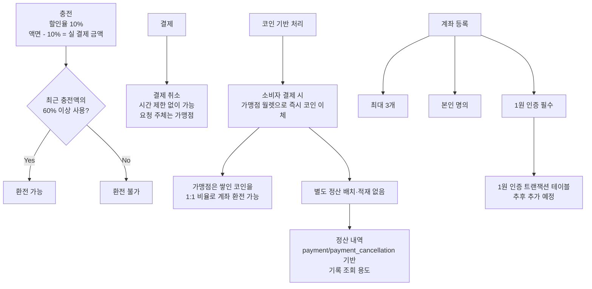
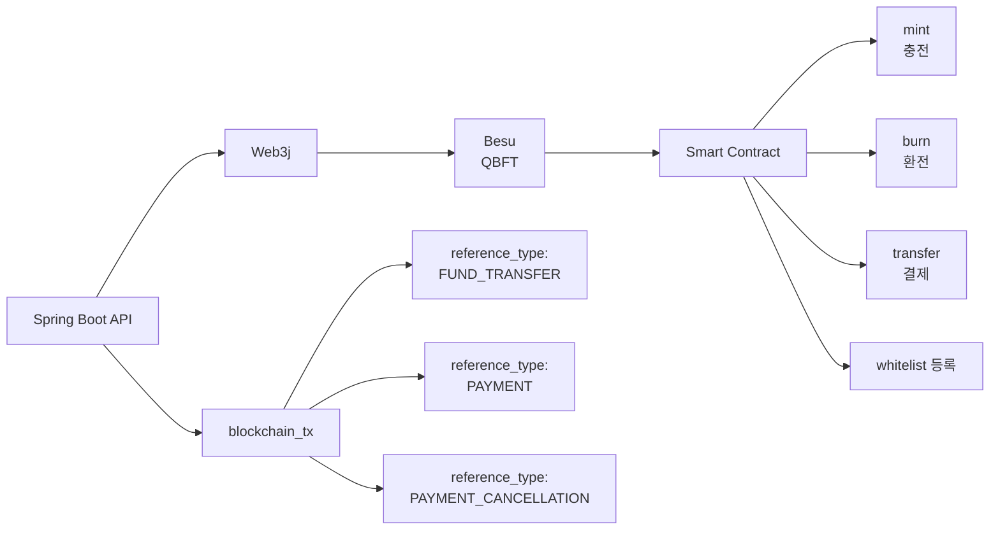
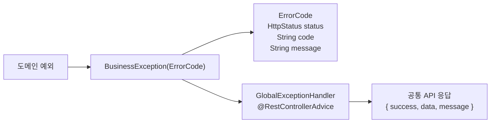

# Backend: hangang-pay-be

Spring Boot 3.5 REST API. 세션 기반 인증. 블록체인(Besu)과 Web3j로 연동.

## Behavioral Guidelines

LLM 코딩 실수를 줄이기 위한 작업 원칙. 프로젝트별 지침과 함께 적용한다.

**Tradeoff:** 속도보다 신중함에 무게를 둔다. 단순한 작업에서는 상황에 맞게 판단한다.



### 1. Think Before Coding

**가정하지 않는다. 헷갈림을 숨기지 않는다. 트레이드오프를 드러낸다.**

- 가정을 명시한다. 확실하지 않으면 질문한다.
- 해석이 여러 개라면 조용히 하나를 고르지 말고 선택지를 제시한다.
- 더 단순한 접근이 있으면 말한다. 필요하면 요구사항에도 이견을 낸다.
- 불명확한 점이 있으면 멈춘다. 무엇이 헷갈리는지 말하고 질문한다.

### 2. Simplicity First

**문제를 해결하는 최소 코드. 추측성 구현은 하지 않는다.**

- 요청받지 않은 기능은 추가하지 않는다.
- 한 번만 쓰는 코드에 추상화를 만들지 않는다.
- 요구되지 않은 유연성이나 설정 가능성을 넣지 않는다.
- 불가능한 시나리오를 위한 에러 처리를 만들지 않는다.
- 200줄로 쓴 코드가 50줄로 가능하다면 다시 단순화한다.

### 3. Surgical Changes

**꼭 필요한 곳만 건드린다. 내가 만든 흔적만 정리한다.**

- 주변 코드, 주석, 포맷을 괜히 개선하지 않는다.
- 고장 나지 않은 코드를 리팩터링하지 않는다.
- 다르게 하고 싶어도 기존 스타일을 따른다.
- 관련 없는 죽은 코드를 발견하면 언급만 하고 삭제하지 않는다.
- 내가 만든 변경 때문에 unused가 된 import, 변수, 함수만 제거한다.

판단 기준: 바뀐 모든 줄은 사용자의 요청과 직접 연결되어야 한다.

### 4. Goal-Driven Execution

**성공 기준을 정하고, 검증될 때까지 반복한다.**

```text
1. [단계] -> 검증: [확인 방법]
2. [단계] -> 검증: [확인 방법]
3. [단계] -> 검증: [확인 방법]
```

성공 기준이 강하면 독립적으로 반복할 수 있다. "동작하게 만들기"처럼 약한 기준은 계속 확인이 필요하다.

## Project Docs

- ERD 상세: `docs/erd.md`
- 패키지/도메인 책임: `docs/package.md`
- REST API 목록과 권한 규칙: `docs/rest_api.md`

## Definition of Done

- 요청 시작 전에 목표 1줄과 DoD를 먼저 확정한다.
- 작업 범위를 모듈/기능 단위로 제한한다.
- 충돌 시 문서 우선순위를 따른다.
- 검증 명령을 실행한다. 기본은 `./gradlew test`다.
- 최종 응답은 고정 포맷으로 보고한다.

## Document Priority

1. 가장 가까운 경로의 `AGENTS.md`
2. 루트 `AGENTS.md`
3. `CLAUDE.md`
4. 변경 성격별 상세 문서
5. 실제 코드

현재 루트 `AGENTS.md`는 `@CLAUDE.md`만 포함한다. Claude와 Codex가 같은 규칙을 보도록 `CLAUDE.md`를 공통 원본으로 사용한다. 하위 경로에 더 가까운 `AGENTS.md`가 생기면 해당 파일이 국소 규칙으로 우선한다.

변경 성격별 상세 문서 우선순위:

- API 경로/요청/응답/권한 충돌: `docs/rest_api.md`
- 엔티티/테이블/enum/관계 충돌: `docs/erd.md`
- 패키지 위치/도메인 책임 충돌: `docs/package.md`

문서와 코드가 충돌하면 근거 문서를 기준으로 정렬하고, 결과를 보고서에 명시한다.

## Mandatory Work Intake

모든 코드 작업 요청은 아래를 먼저 고정한다.

1. 목표 1줄 + DoD
2. 작업 단위: 모듈/기능
3. 변경 권한 범위
4. 타깃 테스트 식별자
5. 검증 명령
6. 응답 포맷
7. 중간 체크포인트: 코드 변경 전 설계 확인, RED 실패 확인 후, GREEN 통과 후

변경 권한 범위에는 수정 가능 파일/디렉터리, 수정 금지 파일/디렉터리, 리네이밍 허용 여부를 포함한다. 리네이밍은 명시적 승인 없으면 금지한다.

## TDD Workflow

모든 코드 변경은 `RED -> GREEN -> REFACTOR` 순서를 따른다.

- RED: 실패하는 테스트를 먼저 추가/수정하고 실패를 확인한다.
- GREEN: 테스트를 통과시키는 최소 구현만 적용한다.
- REFACTOR: 동작을 유지한 채 중복 제거/구조 개선을 수행한다.
- 실패 테스트 증거 없이 구현부터 시작하지 않는다.
- 테스트 미갱신 상태에서 기능/계약 변경을 완료 처리하지 않는다.

작업 시작 시 아래 형식을 우선 채운다. 이 양식은 `Mandatory Work Intake`의 축약형이며, 코드 작업에서는 이 양식을 사용한다.

```text
Goal: 한 줄 목표
DoD: 완료 조건
Module: 대상 모듈
Target Test: ./gradlew test --tests ...
Allowed: 변경 허용 범위
Forbidden: 변경 금지 범위
Checkpoints: 설계 확인 -> RED 실패 확인 -> GREEN 통과 확인
```

## Default Change Permission Policy

요청에 별도 지정이 없으면 아래 기본 정책을 적용한다.

- 수정 가능: 작업 대상 모듈 + 직접 연관 테스트 + 직접 연관 문서
- 수정 금지: 무관 모듈, 인프라/배포 파일, 광범위 리네이밍
- 리네이밍: 명시적 승인 없으면 금지
- 프론트엔드 또는 상위 디렉터리 작업은 명시적 요청 없으면 금지

## Fixed Verification Command

1. 타깃 테스트 실행: `./gradlew test --tests <target>`
2. 전체 테스트 실행: `./gradlew test`

실패 시 실패 원인과 영향 범위를 보고한다. 테스트 타깃을 특정할 수 없는 문서 전용 변경은 테스트 실행 대신 변경 파일과 검토한 근거를 보고한다.

## Fixed Response Format

최종 응답은 아래 순서로 보고한다.

1. 변경 요약 3줄
2. RED / GREEN / REFACTOR 요약
3. 파일 목록
4. 리스크
5. 다음 액션

## Root-Level Architecture Rules

- API는 `/api/v1` prefix와 `docs/rest_api.md`의 경로/권한 매핑을 따른다.
- 공통 응답은 `global/response`의 공통 API 응답 래퍼를 유지한다.
- 비즈니스 예외는 `global/exception/BusinessException` + `ErrorCode`를 사용한다.
- DB 변경 시 엔티티/JPA와 `docs/erd.md`를 함께 갱신한다.
- API 변경 시 controller/dto와 `docs/rest_api.md`를 함께 갱신한다.
- 패키지 위치나 도메인 책임 변경 시 `docs/package.md`를 함께 갱신한다.
- 세션 인증을 JWT로 변경하지 않는다.

## Logging Policy

- 비즈니스 상태 전환, 외부 연동, 인증, 결제, 충전, 환전, 블록체인 처리에는 적절한 로그를 남긴다.
- 단순 DTO, 매핑, 검증 코드에는 불필요한 로그를 추가하지 않는다.
- SLF4J와 Lombok `@Slf4j` 사용을 기본으로 한다.
- `ERROR`: 비즈니스 처리 실패, 외부 연동 실패, 예외 catch 후 복구 불가 상황. 스택트레이스 포함.
- `WARN`: 재시도/폴백 동작, 검증 실패 등 운영자가 인지해야 하는 비정상 상황.
- `INFO`: 주요 비즈니스 이벤트, 상태 전환, 외부 호출 시작/종료, 인증 결과.
- `DEBUG`: 개발/트러블슈팅용 상세 정보. 프로덕션 기본 비활성.
- 필수 컨텍스트: 식별자(`userId`, `merchantId`, `partyId`, `paymentId`, `txHash`, `requestId` 등), 행위, 결과/에러코드.
- 비밀번호, 토큰, 개인정보, 계좌번호 전체, private key 평문 로깅 금지.
- `e.printStackTrace()` 및 `System.out/err` 사용 금지.
- 문자열 결합 대신 SLF4J 파라미터 바인딩을 사용한다. 예: `log.info("paymentId={}", paymentId)`
- 외부 연동 호출은 진입/종료/실패 3지점 로그를 남긴다.
- 예외 처리 시 catch 후 무음 처리하지 않는다. 최소 `WARN` 이상으로 기록한다.

## Docs Sync Rule

다음 변경이 있으면 `docs`도 같이 갱신한다.

- API 경로/요청/응답/권한
- 엔티티/테이블/인덱스/제약/enum
- 모듈 구조/도메인 책임/패키지 위치
- 운영 환경변수
- 외부 연동 방식

## Reference Documents

- `CLAUDE.md`
- `docs/rest_api.md`
- `docs/erd.md`
- `docs/package.md`

## Tech Stack

- Java 17, Spring Boot 3.5.14, Gradle
- Spring Security (세션 인증, JWT 아님)
- Spring Data JPA + MySQL
- SpringDoc OpenAPI 2.8.16 -> `/swagger-ui/index.html`
- Actuator + Micrometer Prometheus -> `/actuator/prometheus`
- Lombok: `@RequiredArgsConstructor` 사용, `@Autowired` 금지

## Commands

```bash
./gradlew bootRun --args='--spring.profiles.active=local'
./gradlew test
./gradlew build -x test
```

`hangang-pay-be/`에서 실행. `./gradlew` 사용(시스템 gradle 금지).

## Package Structure

자세한 내용은 `docs/package.md`를 따른다.



각 도메인 내부 기본 구조: `entity/ service/ repository/ dto/ controller/`

## API Rules

- 모든 엔드포인트 prefix: `/api/v1`
- 응답 포맷: `{ "success": true/false, "data": {}, "message": "" }`
- 엔티티 직접 반환 금지. DTO 변환 필수.
- 모든 엔드포인트 SpringDoc 어노테이션 필수: `@Operation`, `@ApiResponse`
- 승인번호 형식: `APV-YYYY-NNNNNNNN`
- 승인번호는 `payment.id`를 8자리 zero padding해서 생성한다. 예: `payment.id=25` -> `APV-2026-00000025`
- 승인번호 생성은 `payment` 저장으로 id를 확보한 뒤 수행한다.
- 상세 API 목록과 권한 규칙은 `docs/rest_api.md`를 따른다.

## Key Business Rules



## Blockchain Integration



## Error Handling



도메인 예외는 `BusinessException(ErrorCode)`를 상속한다.

## Configuration

- `application.yaml`: 공통 설정. 커밋 대상.
- `application-local.yaml`: DB 연결 정보 등 secrets. 커밋 금지.

```yaml
# application-local.yaml 로컬 개발 전용 예시
spring:
  datasource:
    url: jdbc:mysql://localhost:3306/hangang_pay
    username: <username>
    password: <password>
  jpa:
    hibernate:
      ddl-auto: create-drop
    show-sql: true
```

## Testing

- `@SpringBootTest`: 통합 테스트
- `@WebMvcTest`: 컨트롤러 단위, `spring-security-test` 포함
- `@DataJpaTest`: 리포지토리, H2 in-memory. 기본 CRUD 테스트는 생략한다.
- 클래스명: `{ClassName}Test.java`

Repository 테스트 작성 기준:

- 생략 가능: `findById`, `save`, `delete`, 단순 `findByUsername` 같은 Spring Data JPA 기본/단순 derived query.
- 작성 필요: 커스텀 `@Query`, fetch join, 집계, 페이징/정렬, 기간/상태/권한 조건, 소유권 검증 쿼리.
- 작성 필요: 결제/환전/정산 내역, `blockchain_tx.reference_type + reference_id`, 주계좌 유일성처럼 돈 흐름이나 정합성에 직접 영향을 주는 조회.
- 서비스 테스트에서 같은 조건을 충분히 검증한다면 중복 repository 테스트는 추가하지 않는다.

## What NOT to Do

- 컨트롤러에 비즈니스 로직 작성 금지
- `@Autowired` 필드 주입 금지
- 엔티티를 응답으로 직접 반환 금지
- `application-local.yaml` 커밋 금지
- 세션 인증을 JWT로 변경하지 말 것
- `bank_account`, `bank_wallet`, `contract_address`는 `institution` 도메인에 위치
