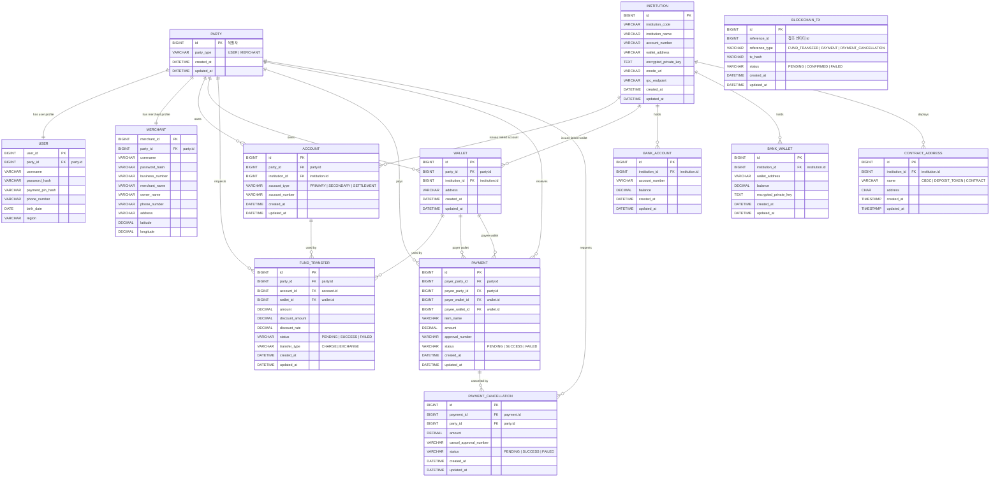

# ERD

현재 ERD 기준. 실제 구현 시 테이블/컬럼명은 영문 snake_case를 사용하고, ERD 초안의 한글명·공백명·슬래시명·오타 컬럼은 의미에 맞게 정규화한다.

## Diagram

## Modeling Rules

- `party`는 `user`와 `merchant`의 상위 엔티티다.
- `account`와 `wallet`은 `party_id`를 통해 소비자와 가맹점 모두 소유할 수 있다.
- `bank_account`, `bank_wallet`, `contract_address`는 `institution` 도메인에 둔다.
- `blockchain_tx.reference_type`은 `FUND_TRANSFER`, `PAYMENT`, `PAYMENT_CANCELLATION`만 사용한다.
- `blockchain_tx.reference_id`는 `reference_type`에 따라 원본 테이블의 id를 의미한다.
- `blockchain_tx.reference_id`는 다형 참조이므로 단일 FK로 특정 테이블 하나에만 묶지 않는다.
- 사용자별/가맹점별 블록체인 기록 조회는 원본 테이블과 조인해서 `party_id`를 찾는다.
- 1원 인증용 트랜잭션 테이블은 추후 별도 추가한다.

## Enum Values

| Field | Values                                             |
| --- |----------------------------------------------------|
| `party.party_type` | `USER`, `MERCHANT`                                 |
| `account.account_type` | `PRIMARY`, `SECONDARY`, `SETTLEMENT`                |
| `fund_transfer.transfer_type` | `CHARGE`, `EXCHANGE`                               |
| `fund_transfer.status` | `PENDING`, `SUCCESS`, `FAILED`                     |
| `payment.status` | `PENDING`, `SUCCESS`, `FAILED`                     |
| `payment_cancellation.status` | `PENDING`, `SUCCESS`, `FAILED`                     |
| `blockchain_tx.reference_type` | `FUND_TRANSFER`, `PAYMENT`, `PAYMENT_CANCELLATION` |
| `blockchain_tx.status` | `PENDING`, `CONFIRMED`, `FAILED`                   |
| `contract_address.name` | `CBDC`, `DEPOSIT_TOKEN`, `CONTRACT`                |

## Settlement Meaning

정산은 별도 적재·배치·입금 프로세스가 아니다. 소비자가 가맹점에게 결제하면 가맹점 월렛으로 코인이 즉시 이체된다. 가맹점은 쌓인 코인을 1:1 비율로 계좌 환전할 수 있다.

`정산 내역`이라는 표현은 실제 정산 테이블이 아니라 `payment`와 `payment_cancellation` 기반 기록 조회 화면/API에서만 사용한다.
