# Package Structure

Base package: `family.fisa.hangangpay`

## Overview

```mermaid
flowchart TD
  root["family.fisa.hangangpay"]
  root --> auth["auth<br/>로그인, 로그아웃, 회원가입, SMS/계좌 인증"]
  root --> client["client<br/>외부 bank 서버 RestClient"]
  root --> domain["domain"]
  root --> global["global"]

  client --> bank["bank<br/>bank-account, bank-wallet, transaction, ledger 연동"]

  domain --> party["party<br/>USER | MERCHANT 상위 엔티티"]
  domain --> user["user<br/>소비자 회원, 프로필, 소비자 내역 조회"]
  domain --> merchant["merchant<br/>가맹점 정보, QR, 마이페이지"]
  domain --> account["account<br/>소비자·가맹점 연결 은행 계좌"]
  domain --> wallet["wallet<br/>소비자·가맹점 서비스 지갑 주소"]
  domain --> institution["institution<br/>기관 목록·참조용 캐시"]
  domain --> transaction["transaction<br/>CHARGE | EXCHANGE | PAYMENT | CANCEL 통합 거래"]

  global --> config["config<br/>Security, JPA, OpenAPI, CORS"]
  global --> exception["exception<br/>BusinessException, GlobalExceptionHandler"]
  global --> code["code<br/>공통 success/error code"]
  global --> pagination["pagination<br/>cursor pagination"]
  global --> response["response<br/>ApiResponse"]
  global --> security["security<br/>SessionAuthenticationFilter"]
  global --> session["session<br/>SessionAttributeNames"]
```



도메인 내부 기본 구조:

```text
entity/
service/
repository/
repository/jpa/
dto/
controller/
code/
```

필요 없는 계층은 만들지 않는다. 예를 들어 `party`는 현재 entity/repository만 둔다.

## Domain Ownership

| Domain | Responsibility |
| --- | --- |
| `auth` | 소비자/가맹점 로그인, 로그아웃, 소비자 회원가입, SMS 인증, 계좌 1원 인증 |
| `client.bank` | `hangang-pay-bank` HTTP 연동. bank 계좌/지갑/거래/블록체인 원장 API 호출 |
| `party` | 소비자와 가맹점의 공통 상위 식별자와 role |
| `user` | 소비자 회원 정보, 소비자 프로필, 소비자 결제/충전/환전 내역 조회 진입점 |
| `merchant` | 가맹점 조회, 사업자 정보 조회, QR 생성, 가맹점 마이페이지 |
| `account` | 소비자와 가맹점이 등록한 외부 은행 계좌, 가맹점 정산 계좌 upsert 로직 |
| `wallet` | 소비자와 가맹점의 서비스 지갑 주소 저장. keypair는 bank가 보유하는 custodial 모델 |
| `institution` | BE에서 참조하는 기관 목록과 기관 코드/식별자 조회 |
| `transaction` | 충전, 환전, 결제, 결제 취소 통합 거래와 소비자 내역 조회 |
| `global` | 공통 설정, 응답 래퍼, 예외 처리, 세션 필터, 커서 페이지네이션 |

## Placement Rules

- 은행 원장 계좌, 은행 보유 지갑, 블록체인 ledger, 컨트랙트 실행 책임은 `hangang-pay-bank`에 둔다.
- BE는 `client.bank`를 통해 bank 서버를 호출하고, 공개 API로 인정한 에러 코드만 매핑한다.
- BE `institution` 도메인은 계좌/지갑/거래에서 참조할 기관 캐시만 담당한다.
- `wallet` 도메인은 지갑 주소만 저장한다. private key 저장/암복호화 책임은 현재 BE 구현에 없다.
- 충전, 환전, 결제, 결제 취소는 별도 `payment`/`transfer` 테이블이 아니라 `transaction` 도메인의 `Transaction` 엔티티로 통합한다.
- 결제 취소 API는 가맹점 API에 노출하되, 원본 데이터는 `transaction` 도메인에서 관리한다.
- 환전은 소비자와 가맹점 모두 사용할 수 있으므로 공통 `transaction` 도메인 기능으로 둔다.
- 마이페이지 메인 화면의 사용자 정보는 별도 `mypage` 도메인을 만들지 않고 `user`와 `merchant` 도메인에서 담당한다.

## Repository Pattern

Repository는 Port & Adapter 패턴을 따른다.

```text
domain/{domain}/repository/{XxxRepository}.java       // 도메인 포트 인터페이스
domain/{domain}/repository/jpa/{XxxJpaRepository}.java // Spring Data JPA 인터페이스
domain/{domain}/repository/{XxxRepositoryImpl}.java   // 어댑터 구현체
```

단, 단순 포트만 있는 `PartyRepository`처럼 아직 adapter 분리가 없는 영역은 필요해질 때 확장한다.

## Service Boundaries

- 도메인 서비스는 기본적으로 읽기/쓰기를 분리한다.
  - `XxxQueryService`: 조회 전용, `@Transactional(readOnly = true)`
  - `XxxCommandService`: 쓰기 전용, `@Transactional`
- 기존 `AccountService`, `WalletService`처럼 과도기 단일 서비스가 남아 있으면 새 기능에서 확산시키지 않는다.
- 계좌 관리는 소비자와 가맹점 모두 사용한다. 공통 `/accounts` API는 현재 임시로 `partyId` query parameter를 받지만, 최종 기준은 세션의 `partyId`다.
- 가맹점 정산 계좌는 `PATCH /api/v1/merchant/accounts`에 노출하고 `AccountCommandService`가 `SETTLEMENT` 계좌를 upsert한다.
- 충전은 소비자 전용이다.
- 환전은 소비자와 가맹점 공통이다.
- 가맹점 매출/결제/정산 내역 조회는 가맹점 전용이다.

## DTO Rules

- 엔티티를 API 응답으로 직접 반환하지 않는다.
- DTO 변환은 `from(...)`, `of(...)` 같은 명시적 팩토리 메서드로 수행한다.
- 커서 페이지네이션 목록 원소 DTO는 `Item` suffix를 사용한다. 예: `PaymentHistoryItem`, `ChargeHistoryItem`, `ExchangeHistoryItem`
- `Item` DTO는 Java `record`를 기본으로 하고 `CursorItem`을 구현한다.
- `Item` DTO에는 Lombok `@Builder`를 붙이지 않는다. record canonical constructor 또는 정적 팩토리로 생성한다.
- `CursorPageResponse<XxxItem>` 형태로 감싸서 반환한다.
- `Response` suffix는 단일 객체 응답 DTO에 사용한다. 예: `UserProfileResponse`, `MerchantQrResponse`

## Coding Rules

- 컨트롤러에 비즈니스 로직을 작성하지 않는다.
- `@Autowired` 필드 주입을 사용하지 않는다.
- 생성자 주입과 Lombok `@RequiredArgsConstructor`를 사용한다.
- 공통 응답은 `ApiResponse`로 감싼다.
- 비즈니스 예외는 `BusinessException(BaseErrorCode)`를 사용한다.
- 컨트롤러에서 세션 값은 문자열 리터럴 대신 `SessionAttributeNames` 상수를 사용한다.
- 기존 스타일을 우선한다.
