# Package Structure

Base package: `family.fisa.hangangpay`

## Overview

```mermaid
flowchart TD
  root["family.fisa.hangangpay"]
  root --> domain["domain"]
  root --> global["global"]
  root --> auth["auth<br/>세션 인증, 로그인/로그아웃, 회원가입, SMS/계좌 인증"]
  root --> client["client<br/>외부 시스템 연동"]

  domain --> party["party<br/>USER | MERCHANT 공통 상위 식별자"]
  domain --> user["user<br/>소비자 회원, 프로필, 이용 내역"]
  domain --> merchant["merchant<br/>가맹점 회원, 사업자 정보, QR, 대시보드, 정산 조회"]
  domain --> account["account<br/>소비자·가맹점 연결 은행 계좌"]
  domain --> wallet["wallet<br/>소비자·가맹점 서비스 월렛"]
  domain --> institution["institution<br/>참조 기관 목록과 기관 코드"]
  domain --> transaction["transaction<br/>충전, 환전, 결제, 결제 취소, 은행/블록체인 거래 식별자"]

  client --> bank["bank<br/>hangang-pay-bank API 호출 및 요청/응답 DTO"]

  auth --> authCode["code<br/>인증 성공/오류 코드"]
  auth --> authController["controller"]
  auth --> authDto["dto"]
  auth --> authService["service"]

  global --> config["config<br/>Security, JPA, OpenAPI, CORS"]
  global --> code["code<br/>공통 성공/오류 코드"]
  global --> entity["entity<br/>BaseEntity"]
  global --> exception["exception<br/>BusinessException, GlobalExceptionHandler"]
  global --> pagination["pagination<br/>커서 페이지네이션"]
  global --> response["response<br/>공통 API 응답 래퍼"]
  global --> security["security<br/>세션 인증 필터"]
  global --> session["session<br/>세션 attribute 상수"]
```



각 도메인은 필요한 하위 패키지만 둔다. 현재 사용 중인 기본 하위 패키지:

```text
code/
controller/
dto/
entity/
repository/
repository/jpa/
scheduler/
service/
```

Repository는 Port & Adapter 패턴을 따른다. 도메인별 포트 인터페이스는 `domain/{domain}/repository`에, Spring Data JPA 인터페이스는 필요 시 `domain/{domain}/repository/jpa`에 둔다.

## Domain Ownership

| Domain | Responsibility |
| --- | --- |
| `party` | 소비자와 가맹점의 공통 상위 식별자 |
| `user` | 소비자 회원 정보, 소비자 프로필, 이용 내역, 마이페이지 메인 프로필 정보 |
| `merchant` | 가맹점 회원 정보, 사업자 정보, QR, 대시보드, 결제/정산 조회 |
| `account` | 소비자와 가맹점이 등록한 외부 은행 계좌 |
| `wallet` | 소비자와 가맹점의 서비스 월렛 |
| `institution` | BE에서 참조하는 기관 목록과 기관 코드/식별자 조회 |
| `transaction` | 충전, 환전, 결제, 결제 취소와 블록체인/은행 거래 식별자 |
| `auth` | 세션 인증, 로그인, 로그아웃, 회원가입, SMS/계좌 인증 |
| `client/bank` | `hangang-pay-bank` API 호출과 은행 API 요청/응답 DTO |

## Placement Rules

- 은행 원장 계좌, 은행 보유 지갑, 컨트랙트 주소와 배포 책임은 `hangang-pay-bank`에 둔다.
- BE에서 은행 기능이 필요하면 `client/bank`를 통해 `hangang-pay-bank` API를 호출한다.
- BE `institution` 도메인은 계좌/지갑/거래에서 참조할 기관 캐시만 담당한다.
- `account` 도메인은 소비자/가맹점이 등록한 연결 은행 계좌만 담당한다.
- `wallet` 도메인은 소비자/가맹점이 사용하는 서비스 월렛만 담당한다.
- 결제 취소 API는 가맹점 API에 노출하되, 원본 데이터는 `transaction` 도메인에서 관리한다.
- 환전은 소비자와 가맹점 모두 사용할 수 있으므로 공통 `transaction` 도메인 기능으로 둔다.
- 마이페이지 메인 화면의 사용자 정보는 별도 `mypage` 도메인을 만들지 않고 `user` 도메인에서 담당한다.
- 마이페이지 화면의 결제/충전/환전/계좌 메뉴는 각 도메인 API로 이동하는 진입점이며, 메인 조회 API 책임에 포함하지 않는다.

## Service Boundaries

- 계좌 관리는 소비자와 가맹점 모두 사용한다. API는 공통 `/accounts`를 쓰고, 현재 세션의 `partyId`로 자신의 계좌만 다룬다.
- 소비자와 가맹점 서비스가 분리되어 있더라도 계좌의 핵심 비즈니스 로직은 `account` 서비스 계층에 둔다.
- 역할별 응답 모양이 달라지면 controller 또는 DTO 계층에서 분기한다.
- 충전은 소비자 전용이다.
- 환전은 소비자와 가맹점 공통이다.
- 가맹점 매출/결제/정산 내역 조회는 가맹점 전용이다.

## Coding Rules

- 컨트롤러에 비즈니스 로직을 작성하지 않는다.
- 엔티티를 API 응답으로 직접 반환하지 않는다.
- DTO 변환을 명시적으로 수행한다.
- `@Autowired` 필드 주입을 사용하지 않는다.
- 생성자 주입과 Lombok `@RequiredArgsConstructor`를 사용한다.
- 기존 스타일을 우선한다.
