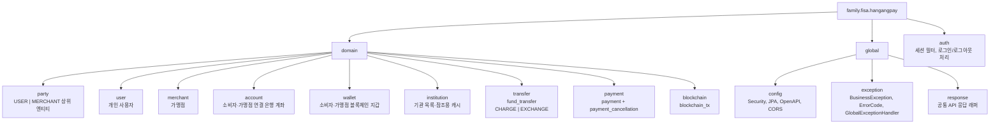

# Package Structure

Base package: `family.fisa.hangangpay`

## Overview



각 도메인 내부 기본 구조:

```text
entity/
service/
repository/
dto/
controller/
```

## Domain Ownership

| Domain | Responsibility |
| --- | --- |
| `party` | 소비자와 가맹점의 공통 상위 식별자 |
| `user` | 소비자 회원 정보, 소비자 프로필, 마이페이지 메인 프로필 정보 |
| `merchant` | 가맹점 회원 정보, 사업자 정보, 가맹점 대시보드 |
| `account` | 소비자와 가맹점이 등록한 외부 은행 계좌 |
| `wallet` | 소비자와 가맹점의 서비스 월렛 |
| `institution` | BE에서 참조하는 기관 목록과 기관 코드/식별자 조회 |
| `transfer` | 충전과 환전 신청/상태/영수증 |
| `payment` | 결제와 결제 취소 |
| `blockchain` | 블록체인 트랜잭션 기록 |
| `auth` | 세션 인증, 로그인, 로그아웃, SMS/계좌 인증 |

## Placement Rules

- 은행 원장 계좌, 은행 보유 지갑, 컨트랙트 주소와 배포 책임은 `hangang-pay-bank`에 둔다.
- BE `institution` 도메인은 계좌/지갑/거래에서 참조할 기관 캐시만 담당한다.
- `account` 도메인은 소비자/가맹점이 등록한 연결 은행 계좌만 담당한다.
- `wallet` 도메인은 소비자/가맹점이 사용하는 서비스 월렛만 담당한다.
- `blockchain_tx`는 `blockchain` 도메인에 둔다.
- 결제 취소 API는 가맹점 API에 노출하되, 원본 데이터는 `payment` 도메인에서 관리한다.
- 환전은 소비자와 가맹점 모두 사용할 수 있으므로 공통 `transfer` 도메인 기능으로 둔다.
- 마이페이지 메인 화면의 사용자 정보는 별도 `mypage` 도메인을 만들지 않고 `user` 도메인에서 담당한다.
- 마이페이지 화면의 결제/충전/환전/계좌 메뉴는 각 도메인 API로 이동하는 진입점이며, 메인 조회 API 책임에 포함하지 않는다.

## Service Boundaries

- 계좌 관리는 소비자와 가맹점 모두 사용한다. API는 공통 `/accounts`를 쓰고, 현재 세션의 `partyId`로 자신의 계좌만 다룬다.
- 소비자와 가맹점 서비스가 분리되어 있더라도 계좌의 핵심 비즈니스 로직은 공통 `AccountService`에 둔다.
- 역할별 응답 모양이 달라지면 controller 또는 DTO 계층에서 분기한다.
- 충전은 소비자 전용이다.
- 환전은 소비자와 가맹점 공통이다.
- 가맹점 매출/결제/정산 내역 조회는 가맹점 전용이다.

## Coding Rules

- 컨트롤러에 비즈니스 로직을 작성하지 않는다.
- 엔티티를 API 응답으로 직접 반환하지 않는다.
- DTO 변환을 명시적으로 수행한다.
- `@Autowired` 필드 주입을 사용하지 않는다.
- 생성자 주입과 Lombok `@RequiredArgsConstructor`를 사용한다.
- 기존 스타일을 우선한다.
