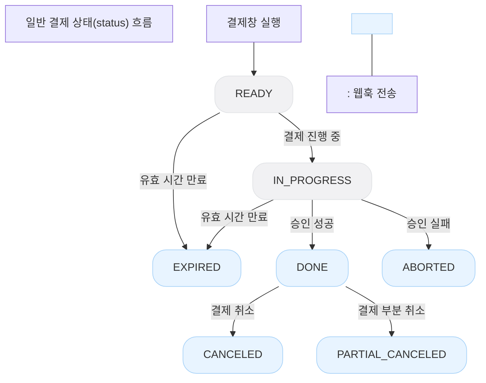
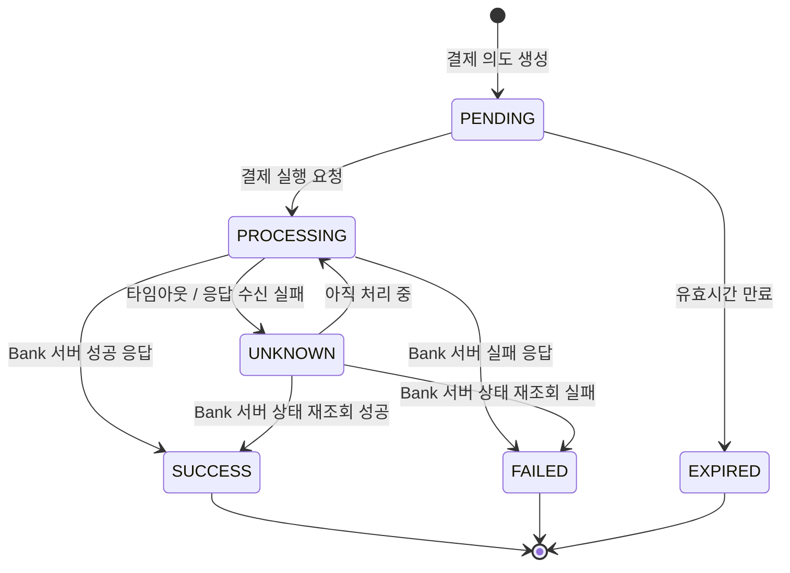
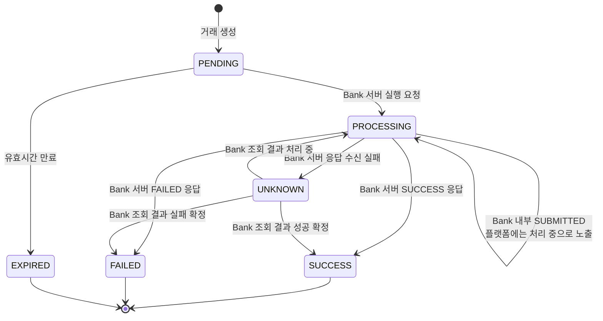
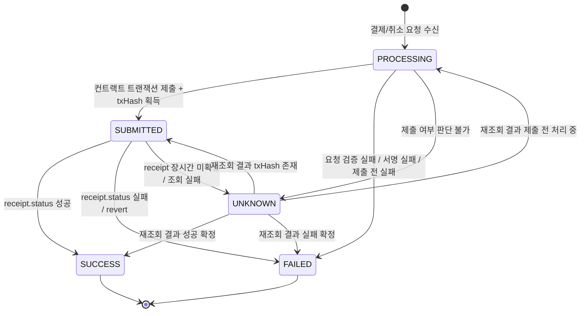

# 1. 트랜잭션 상태 머신

결제 시스템에서 상태 머신을 두는 이유는 단순하다.

**결제가 지금 어디까지 진행됐는지, 다음에 무엇을 해야 하는지 서버가 명확하게 알기 위해서다.**

특히 결제는 외부 Bank 서버 호출이 끼어 있다.
즉, 우리 서버가 요청을 보냈는데 Bank 서버가 응답을 못 주거나, 네트워크가 끊기거나, 사용자가 버튼을 다시 누르는 상황이 생긴다.

이때 상태가 단순히 `SUCCESS / FAILED` 두 개뿐이면 문제가 된다.

```
Bank 서버에 결제 요청을 보냄
→ 응답이 오기 전에 타임아웃
→ 실제로 결제됐는지 안 됐는지 모름
→ 사용자에게는 실패라고 말할 수도 없고, 성공이라고 말할 수도 없음
```

그래서 중간 상태가 필요하다.

---

## 목차

1. 왜 상태 머신이 필요한가
2. 토스페이먼츠 상태 흐름 참고
3. 우리 서비스의 상태 정의
4. 상태 전이 규칙
5. **`UNKNOWN`** 상태를 두는 이유
6. **`EXPIRED`** 처리 방식
7. 결제 취소와 부분 취소
8. 최종 결론

---

## 1. 왜 상태 머신이 필요한가

결제는 일반적인 CRUD가 아니다.

```
요청 받음
→ DB 저장
→ 외부 Bank 서버 호출
→ Bank 서버 내부에서 지갑 transfer
→ 응답 수신
→ 플랫폼 DB 상태 변경 - (트랜잭션 테이블)
```

이 사이에 실패 지점이 많다.

- 사용자가 결제 버튼을 여러 번 누를 수 있다.
- Bank 서버 호출이 느릴 수 있다.
- 네트워크 타임아웃이 발생할 수 있다.
- Bank 서버에서는 성공했는데 우리 서버가 응답을 못 받을 수 있다.
- 사용자가 QR을 다시 스캔할 수 있다.

결국 중요한 건 이것이다.

> **같은 결제가 두 번 실행되면 안 되고, 결과를 모르는 결제는 반드시 다시 확인할 수 있어야 한다.**
>

그래서 `TransactionStatus`는 단순한 표시값이 아니라, 결제 복구 로직의 기준이 된다.

---

## 2. 토스페이먼츠 상태 흐름 참고

토스페이먼츠의 결제 상태는 대략 아래처럼 흘러간다.


| 토스페이먼츠 상태 | 의미 |
| --- | --- |
| `READY` | 결제 객체가 생성된 초기 상태 |
| `IN_PROGRESS` | 결제수단 인증이 완료되고 승인 API 호출을 기다리는 상태 |
| `DONE` | 결제 승인 성공 |
| `ABORTED` | 결제 승인 실패 |
| `CANCELED` | 승인된 결제가 취소된 상태 |
| `PARTIAL_CANCELED` | 결제 금액 중 일부만 취소된 상태 |
| `EXPIRED` | 유효시간이 지나 만료된 상태 |

여기서 핵심은 **`EXPIRED`**가 따로 존재한다는 점이다.

결제창을 열고 아무것도 하지 않았거나, 인증 후 승인 API를 정해진 시간 안에 호출하지 않으면 성공도 실패도 아니다.
그냥 **만료된 결제**다.

우리 서비스도 이 개념을 가져오는 게 맞다.

---

## 3. 우리 서비스의 상태 정의

우리 서비스는 PG 결제창을 그대로 구현하는 구조가 아니다.

현재 구조는 `hangang-pay-be`가 Bank 서버에 결제 요청을 보내고, Bank 서버가 지갑 transfer를 수행하는 형태다.
그래서 토스페이먼츠 상태를 그대로 복사하기보다는 우리 흐름에 맞게 줄여서 가져간다.

| 상태 | 의미 |
| --- | --- |
| `PENDING` | 결제 의도가 생성됐지만 아직 Bank 서버에 결제 실행 요청을 보내지 않은 상태 |
| `PROCESSING` | Bank 서버에 결제 실행 요청을 보낸 상태 |
| `SUCCESS` | Bank 서버 결제 성공 응답을 받아 최종 성공한 상태 |
| `FAILED` | Bank 서버가 실패를 응답했거나 복구 조회 결과 실패로 확정된 상태 |
| `UNKNOWN` | Bank 서버에 요청은 보냈지만 결과를 모르는 상태 |
| `EXPIRED` | 결제 유효시간이 지나 더 이상 진행하지 않는 상태 |

---

## 4. 상태 전이 규칙

기본 흐름은 아래와 같다.



중요한 점은 `PENDING`과 `PROCESSING`을 나누는 것이다.

```
PENDING
→ 아직 Bank 서버에 결제 실행 요청을 보내지 않음
→ 만료시켜도 실제 결제가 발생하지 않음

PROCESSING
→ Bank 서버에 결제 실행 요청을 보냄
→ 함부로 실패 처리하면 안 됨
→ 결과를 모르면 UNKNOWN으로 둬야 함
```

이 구분이 없으면 타임아웃 상황에서 위험해진다.

---

## 5. `UNKNOWN` 상태를 두는 이유

가장 애매한 상황은 이것이다.

```java
try {
    BankPaymentResponse result = bankClient.payment(request);
    transaction.completeWithBankResponse(result.txHash(), null);
} catch (TimeoutException e) {
    transaction.markUnknown();
}
```

Bank 서버에 요청을 보냈는데 타임아웃이 발생했다.

이때는 실제로 두 가지 가능성이 있다.

```
1. Bank 서버가 요청을 처리하지 못했다.
2. Bank 서버는 결제를 성공시켰는데 응답만 우리 서버로 못 왔다.
```

이 상황에서 `FAILED`로 저장하면 위험하다.
실제로는 결제가 성공했는데 우리 서버만 실패라고 믿게 된다.

그래서 `UNKNOWN`이 필요하다.

`UNKNOWN`은 실패가 아니다.
정확히는 **결과 확인이 필요한 상태**다.

---

## 6. `UNKNOWN` 복구 방식

`UNKNOWN`을 제대로 쓰려면 Bank 서버에도 조회 API가 있어야 한다.

현재 Bank 서버도 우리가 만드는 별도 Spring 서버이므로, 아래 계약을 추가하는 게 좋다.

```
GET /api/v1/transactions/{transactionUuid}
```

응답은 최소한 아래 정보를 줘야 한다.

```json
{
  "transactionUuid": "uuid",
  "status": "SUBMITTED",
  "txHash": "0x...",
  "confirmedAt": null
}
```

여기서 txHash는 Bank 서버가 블록체인 네트워크에 트랜잭션을 제출하고 받은 식별자다.

즉, txHash가 존재한다는 것은 아래 의미에 가깝다.

```sql
Bank 서버가 컨트랙트 트랜잭션을 생성했다.
→ 네트워크에 제출했다.
→ txHash를 받았다.
→ 하지만 아직 실제 실행 성공 여부는 확정되지 않았다.
```

실제 성공 여부는 TransactionReceipt를 조회해서 확인해야 한다.

```sql
txHash 있음
→ 온체인 트랜잭션 제출 완료
→ 아직 receipt 확인 전이면 SUBMMITED / PROCESSING

receipt 있음 + receipt.status 성공
→ SUCCESS

receipt 있음 + receipt.status 실패
→ FAILED

receipt 없음
→ 아직 처리 중이거나 추가 조회가 필요한 상태
```

그래서 Bank 서버 조회 API는 txHash가 있다고 바로 SUCCESS를 내려주면 안 된다.

SUCCESS는 컨트랙트 실행 결과가 확정된 뒤에만 내려준다.

```json
{
  "transactionUuid": "uuid",
  "status": "SUCCESS",
  "txHash": "0x...",
  "confirmedAt": "2026-05-25T10:00:00"
}
```

위 응답은 아래 조건이 만족됐을 때만 가능하다.

```json
txHash 조회
→ TransactionReceipt 조회 성공
→ receipt.status 성공 확인
→ confirmedAt 기록
→ SUCCESS 반환
```

실패한 경우도 마찬가지다.

```json
{
  "transactionUuid": "uuid",
  "status": "FAILED",
  "txHash": "0x...",
  "confirmedAt": "2026-05-25T10:00:00",
  "failureReason": "REVERTED"
}
```

정리하면 Bank 서버의 상태는 최소한 아래 흐름을 표현할 수 있어야 한다.

```json
PROCESSING
→ 아직 txHash도 없고 Bank 서버 내부에서 처리 중 → txHash는 있지만 receipt 확인 전

SUCCESS
→ receipt.status 성공 확인

FAILED
→ receipt.status 실패 확인

UNKNOWN
→ 요청 자체의 결과를 판단할 수 없음
```

우리 BE 서버에서는 SUBMITTED를 별도 상태로 노출하지 않고 PROCESSING으로 매핑해도 된다.

다만 Bank 서버 내부에서는 **SUBMITTED** 같은 중간 상태를 두는 것이 안전하다.

우리 서버는 스케줄러로 `UNKNOWN` 목록을 조회한다.

```java
@Scheduled(fixedDelay = 5000)
public void resolveUnknown() {
    List<Transaction> unknowns = transactionRepository.findAllByStatus(UNKNOWN);

    for (Transaction transaction : unknowns) {
        BankTxStatusResponse result =
                bankClient.getTxStatus(transaction.getTransactionUuid());

        if (result.isSuccess()) {
            transaction.completeWithBankResponse(result.txHash(), null);
        } else if (result.isFailed()) {
            transaction.markFailed();
        }
    }
}
```

여기서 조회 기준은 `txHash`가 아니라 `transactionUuid`가 맞다.

타임아웃이 발생한 시점에는 `txHash`를 못 받았을 수 있기 때문이다.

---

## 7. `EXPIRED` 처리 방식

처음에는 이런 생각했다.

```
같은 사용자의 기존 PENDING 결제가 있으면
→ 기존 PENDING을 EXPIRED로 바꿈
→ 새 PENDING 생성
```

하지만 이 방식은 쓰기 작업이 많아진다.
그리고 재시도 요청마다 기존 결제를 만료시키면 흐름이 복잡해진다.

더 나은 방식은 이렇다.

```
1. 같은 사용자에게 살아있는 PENDING 결제가 있는지 확인
2. 아직 expiresAt 이전이면 기존 PENDING을 그대로 반환
3. expiresAt이 지났으면 그때 EXPIRED 처리
4. 새 결제 의도를 생성
```

즉, 기존 `PENDING`을 매번 만료시키는 게 아니라 **살아있는 결제 의도는 재사용**한다.

이렇게 하면 사용자가 버튼을 다시 누르거나 QR을 다시 스캔해도 같은 결제 화면을 보여줄 수 있다.

```
PENDING + expiresAt 이전
→ 기존 결제 정보 반환

PENDING + expiresAt 이후
→ EXPIRED 처리 후 새 결제 생성
```

더 줄이고 싶다면 DB에 바로 `EXPIRED`를 쓰지 않고, 조회 시점에 `expiresAt < now`이면 만료로 간주하는 방식도 가능하다.
다만 운영 통계나 관리자 화면에서 상태값이 필요하면 스케줄러로 늦게 정리하면 된다.

---

## 8. 결제 취소와 부분 취소

토스페이먼츠에는 **`CANCELED`**, **`PARTIAL_CANCELED`**가 있다.

우리 서비스는 현재 **`TransactionType`**에 **`PAYMENT`**, **`CANCEL`**로 두는 구조가 더 자연스럽다.

```
**PAYMENT** 성공
→ 원 거래는 SUCCESS 유지

취소 요청
→ **CANCEL** 타입의 새 Transaction 생성
→ Bank 서버에 역방향 transfer 요청
→ CANCEL transaction이 SUCCESS / FAILED / UNKNOWN 상태를 가짐
```

즉, 원 결제 row의 상태를 `CANCELED`로 바꾸기보다는 **취소 거래를 별도 거래로 남기는 방식**이다.

부분 취소는 일단 보류한다.

부분 취소를 하려면 아래를 같이 설계해야 한다.

- 원 거래 금액
- 취소 누적 금액
- 남은 취소 가능 금액
- 여러 번 부분 취소했을 때의 이력
- Bank 서버의 부분 transfer/reversal 지원 여부

지금 단계에서는 전체 취소만 먼저 잡는 게 낫다.

---

## 9. 최종 결론

우리 서비스의 결제 상태는 아래처럼 가져간다.

#### Platform 서버



```
PENDING
→ PROCESSING
→ SUCCESS / FAILED / UNKNOWN

PENDING
→ EXPIRED

UNKNOWN
→ SUCCESS / FAILED
```

#### Bank 서버



```json
PROCESSING
→ SUBMITTED
 SUCCESS / UNKNOWN / FAILD

→ FAILD
```

- Bank 서버가 내부적으로는 txHash는 받았지만 receipt 전 상태를 **`SUBMITTED`**로 관리한다.
- 플랫폼 API 응답에서는 아직 최종 결과가 아니므로 **`PROCESSING`**으로 매핑한다.
