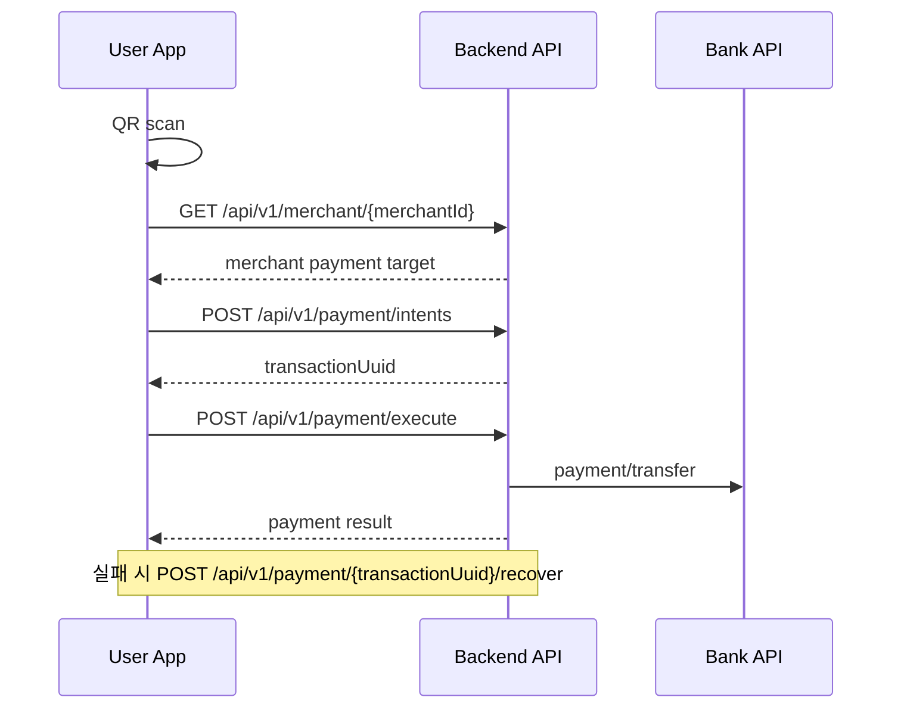

# REST API

모든 API 경로 앞에는 `/api/v1` prefix를 붙인다. 아래 표의 path는 prefix를 제외한 경로다.  
단, `MERCHANT-009`는 예외로 `/api/v2`를 사용한다.

## Common Rules

- 인증 방식은 세션 기반이다. JWT로 변경하지 않는다.
- `Auth` 값이 `O`이면 로그인 세션이 필요하다.
- `Auth` 값이 `X`이면 비로그인 호출이 가능하다.
- 모든 응답은 공통 래퍼를 사용한다.
- 모든 엔드포인트에는 SpringDoc 어노테이션을 작성한다.
- request/response JSON은 아직 확정하지 않는다. DTO 설계 시 사람이 직접 검토한다.
- 결제 승인번호 형식은 `APV-YYYY-NNNNNNNN`이다.
- 승인번호는 `transaction.id`를 8자리 zero padding해서 생성한다. 예: `transaction.id=25` -> `APV-2026-00000025`
- 승인번호 생성은 `transaction` 저장으로 id를 확보한 뒤 수행한다.

```json
{
  "isSuccess": true,
  "status": 200,
  "code": "PAYMENT_EXECUTED",
  "message": "결제가 완료되었습니다.",
  "result": {}
}
```

## Role Rules

| Role | Meaning |
| --- | --- |
| `PUBLIC` | 비로그인 가능 |
| `USER` | 소비자 세션 필요 |
| `MERCHANT` | 가맹점 세션 필요 |
| `USER \| MERCHANT` | 소비자와 가맹점 모두 가능 |

계좌와 지갑 잔액 API는 소비자/가맹점 모두 사용한다. 서비스가 분리되어 있더라도 현재 세션의 `partyId`를 기준으로 자신의 데이터만 조회·변경한다.

## Payment Flow

QR에는 가맹점 id가 들어있다. 소비자가 QR을 스캔하면 가맹점 정보를 조회하고, 금액 입력 화면으로 전환한 뒤 결제를 실행한다.



결제 취소는 시간 제한 없이 가능하다. 요청 주체는 가맹점이다.

### 결제·취소 실행 결과와 재시도

결제 실행(`PAY-003`)과 결제 취소(`MERCHANT-004`)는 Bank 호출 결과에 따라 세 가지로 분기한다.

| 결과 | HTTP | 응답 형태 | 의미 |
| --- | --- | --- | --- |
| `SUCCESS` | `200` | 공통 래퍼 `result`에 거래 결과 | 정상 완료 |
| `UNKNOWN` | `200` | `result.status = UNKNOWN` | 은행 처리 확정 불가. 복구 API(`PAY-004`)와 스케줄러가 이후 정산 |
| `FAILED` | `4xx` | `BusinessException` 에러 응답(`isSuccess=false`) | 은행이 결정적으로 거부. 성공 응답이 아니라 에러로 내려간다 |

Bank 호출은 일시적 오류(연결/타임아웃, `5xx`, `409 DUPLICATE_PROCESSING`)에 한해 짧은 지연 후 **1회 동기 재시도**한다. 재시도 후에도 미해결이면 `UNKNOWN`으로 저장하고 복구 경로에 위임한다. 결정적 실패(`4xx` 등)는 재시도 없이 즉시 `FAILED`로 확정하고 정규화된 에러 코드를 던진다. Bank가 `transactionUuid`로 멱등 처리하므로 재시도가 이중 결제를 일으키지 않는다.

FAILED 시 내려가는 정규화 에러 코드:

| code | HTTP | 매핑 원천(Bank) |
| --- | --- | --- |
| `PAYMENT_INSUFFICIENT_BALANCE` | `400` | `TRANSACTION_INSUFFICIENT_BALANCE` |
| `PAYMENT_ALREADY_FAILED` | `422` | `TRANSACTION_ALREADY_FAILED` |
| `PAYMENT_FAILED` | `502` | 매핑되지 않은 그 외 Bank 실패(폴백) |
| `CANCEL_ALREADY_FAILED` | `422` | `TRANSACTION_ALREADY_FAILED` |
| `CANCEL_FAILED` | `502` | 매핑되지 않은 그 외 Bank 취소 실패(폴백) |

## Settlement and Exchange

정산은 가맹점이 보유한 토큰을 1:1 비율로 계좌 환전 신청한 기록을 의미한다.

`/merchant/settlements`는 별도 정산 테이블 조회가 아니라 `transaction` 테이블에서 현재 가맹점의 환전 거래를 조회하는 API다. 조회 대상은 `from_party_id`가 현재 가맹점의 `partyId`이고 `transaction_type`이 `EXCHANGE`인 거래다.

서비스 용어는 `exchange`와 `환전`을 사용한다.

환전(소비자 `EXCHANGE-002/003`, 가맹점 `MERCHANT-007/008`)은 결제와 동일하게 **2단계**로 처리한다.

1. **의도 생성**(`/intents`): PIN·게이트 없이 자격 검증(소비자만) 후 `PENDING` `transaction`을 먼저 커밋한다. `transactionUuid`는 FE가 생성한다.
2. **실행**(`/{transactionUuid}/execute`): PIN 검증 → Redis 멱등 게이트 → `PENDING→PROCESSING` 선점 → bank 동기 호출 → `SUCCESS`/`FAILED`/`UNKNOWN` 확정.

DB intent가 게이트보다 먼저 커밋되므로 실행 중 어디서 실패해도 거래 레코드가 남아 복구된다. 상태/복구 규칙:

- 타임아웃·불확실 응답은 `FAILED`로 단정하지 않고 `UNKNOWN`으로 둔다.
- 배치가 `PROCESSING`/`UNKNOWN` 거래를 bank 재조회(`getStatus`)로 확정한다(재실행 아님, `retry_count` 예산 10회).
- 실행되지 않고 버려진 `PENDING` 의도는 만료 배치가 TTL(10분) 경과 시 `EXPIRED`로 정리한다.

## Hold Policy

| API ID | Status | Reason |
| --- | --- | --- |
| `AUTH-005` | 보류 | 비밀번호 재설정 |
| `WALLET-002` | 장기 보류 | 근처 가맹점 조회. 구현 복잡도 |

SMS 인증과 계좌 1원 인증은 mock으로 처리한다. 백엔드는 인증 코드를 생성해 세션에 저장하고 로그로 출력한다.

## API Catalog

| ID | Name | Method | Path | Auth | Role | Notes |
| --- | --- | --- | --- | --- | --- | --- |
| `AUTH-001` | SMS 인증번호 발송 | `POST` | `/auth/sms/send` | `X` | `PUBLIC` | mock 인증 코드를 로그로 출력 |
| `AUTH-002` | SMS 인증번호 검증 | `POST` | `/auth/sms/verify` | `X` | `PUBLIC` | 회원가입 인증 상태를 세션에 저장 |
| `AUTH-003` | 계좌 1원 인증 발송 | `POST` | `/auth/account/send` | `X` | `PUBLIC` | mock 인증 코드를 로그로 출력 |
| `AUTH-004` | 계좌 1원 인증 검증 | `POST` | `/auth/account/verify` | `X` | `PUBLIC` | 회원가입 인증 상태를 세션에 저장 |
| `LOGIN-001` | 로그인 (소비자) | `POST` | `/auth/users/login` | `X` | `PUBLIC` | 세션 생성 |
| `LOGIN-002` | 로그인 (가맹점) | `POST` | `/auth/merchants/login` | `X` | `PUBLIC` | 세션 생성 |
| `LOGOUT-001` | 로그아웃 | `POST` | `/auth/logout` | `O` | `USER \| MERCHANT` | 현재 세션 삭제 |
| `REG-001` | 소비자 회원가입 | `POST` | `/auth/users/register` | `X` | `PUBLIC` | 휴대폰·계좌 인증 세션 확인 후 회원/주계좌/지갑 생성 |
| `REG-002` | 사업자 정보 조회 | `GET` | `/auth/merchants/business-info` | `X` | `PUBLIC` | 쿼리 파라미터: `businessNumber` |
| `REG-003` | 가맹점 회원가입 | `POST` | `/auth/merchants/register` | `X` | `PUBLIC` | |
| `ACCOUNT-001` | 등록 계좌 목록 조회 | `GET` | `/accounts` | `O` | `USER \| MERCHANT` | 현재 세션의 `partyId` 기준 |
| `ACCOUNT-002` | 계좌 추가 | `POST` | `/accounts` | `O` | `USER \| MERCHANT` | 현재 세션의 `partyId` 기준 |
| `ACCOUNT-003` | 계좌 삭제 | `DELETE` | `/accounts/{accountId}` | `O` | `USER \| MERCHANT` | 본인 계좌만 삭제 |
| `ACCOUNT-004` | 주거래 계좌 변경 | `PATCH` | `/accounts/{accountId}/primary` | `O` | `USER \| MERCHANT` | 본인 계좌만 변경 |
| `PAY-001` | QR 가맹점 정보 조회 | `GET` | `/merchant/{merchantId}` | `O` | `USER` | QR 스캔 후 결제 플로우 진입 |
| `PAY-002` | 결제 의도 생성 | `POST` | `/payment/intents` | `O` | `USER` | 금액·가맹점 정보 전달; transactionUuid 반환 |
| `PAY-003` | 결제 실행 | `POST` | `/payment/execute` | `O` | `USER` | 소비자 전용; 결과 SUCCESS/UNKNOWN=200, FAILED=4xx (상세는 Payment Flow) |
| `PAY-004` | 결제 상태 복구 | `POST` | `/payment/{transactionUuid}/recover` | `O` | `USER` | 결제 실패·중단 시 상태 복구 |
| `CHARGE-001` | 충전 정보 조회 | `GET` | `/charge/init` | `O` | `USER` | 충전 한도·할인 계산 포함 |
| `CHARGE-002` | 충전 실행 | `POST` | `/charge` | `O` | `USER` | 소비자 전용 |
| `EXCHANGE-001` | 환전 정보 조회 | `GET` | `/exchange/init` | `O` | `USER \| MERCHANT` | 환전 가능 여부·예정 금액 포함 |
| `EXCHANGE-002` | 환전 의도 생성 | `POST` | `/exchange/intents` | `O` | `USER` | FE 생성 `transactionUuid`; 자격(60%) 검증 후 PENDING 의도 생성. PIN 없음 |
| `EXCHANGE-003` | 환전 실행 | `POST` | `/exchange/{transactionUuid}/execute` | `O` | `USER` | PIN 검증 → 1:1 계좌 환전 |
| `MERCHANT-001` | 가맹점 매출 요약 조회 | `GET` | `/merchant/dashboard` | `O` | `MERCHANT` | 가맹점 전용 |
| `MERCHANT-002` | 가맹점 결제 내역 조회 | `GET` | `/merchant/payments` | `O` | `MERCHANT` | 가맹점 전용; item의 `transactionId`를 상세조회 path에 사용 |
| `MERCHANT-003` | 가맹점 결제 상세 조회 | `GET` | `/merchant/payments/{transactionId}` | `O` | `MERCHANT` | `transactionId`는 `transaction.id`; 응답에 `PAYMENT`/`CANCEL` 타입 포함 |
| `MERCHANT-004` | 결제 취소 | `POST` | `/merchant/payments/{paymentId}/cancel` | `O` | `MERCHANT` | 시간 제한 없음; 결과 SUCCESS/UNKNOWN=200, FAILED=4xx (상세는 Payment Flow) |
| `MERCHANT-005` | 가맹점 정산 내역 조회 | `GET` | `/merchant/settlements` | `O` | `MERCHANT` | 현재 가맹점의 `EXCHANGE` 거래 조회 (`transaction.from_party_id = partyId`) |
| `MERCHANT-006` | 가맹점 정산 신청 조회 | `GET` | `/merchant/redeem` | `O` | `MERCHANT` | 토큰→현금 잔액·계좌 조회 |
| `MERCHANT-007` | 가맹점 정산 의도 생성 | `POST` | `/merchant/redeem/intents` | `O` | `MERCHANT` | FE 생성 `transactionUuid`; PENDING 의도 생성. PIN 없음 |
| `MERCHANT-008` | 가맹점 정산 실행 | `POST` | `/merchant/redeem/{transactionUuid}/execute` | `O` | `MERCHANT` | PIN 검증 → 1:1 계좌 환전 |
| `MERCHANT-009` | 가맹점 QR 생성/조회 | `GET` | `/merchant/qr` | `O` | `MERCHANT` | 결제용 QR 코드 (merchantId 포함) |
| `MERCHANT-010` | 가맹점 마이페이지 조회 | `GET` | `/merchant/mypage` | `O` | `MERCHANT` | |
| `MERCHANT-011` | 가맹점 계좌 변경 | `PATCH` | `/merchant/accounts` | `O` | `MERCHANT` | SETTLEMENT 계좌 upsert |
| `MY-001` | 사용자 마이페이지 조회 | `GET` | `/users/profile` | `O` | `USER` | 소비자 전용 |
| `MY-002` | 사용자 내역 조회 | `GET` | `/users/histories` | `O` | `USER` | 소비자 전용 |
| `MY-003` | 내역 상세 조회 | `GET` | `/users/histories/{historyId}` | `O` | `USER` | 소비자 전용 |
| `WALLET-001` | 잔액 조회 | `GET` | `/wallet/balance` | `O` | `USER \| MERCHANT` | 역할별 서비스/응답 분리 가능 |
