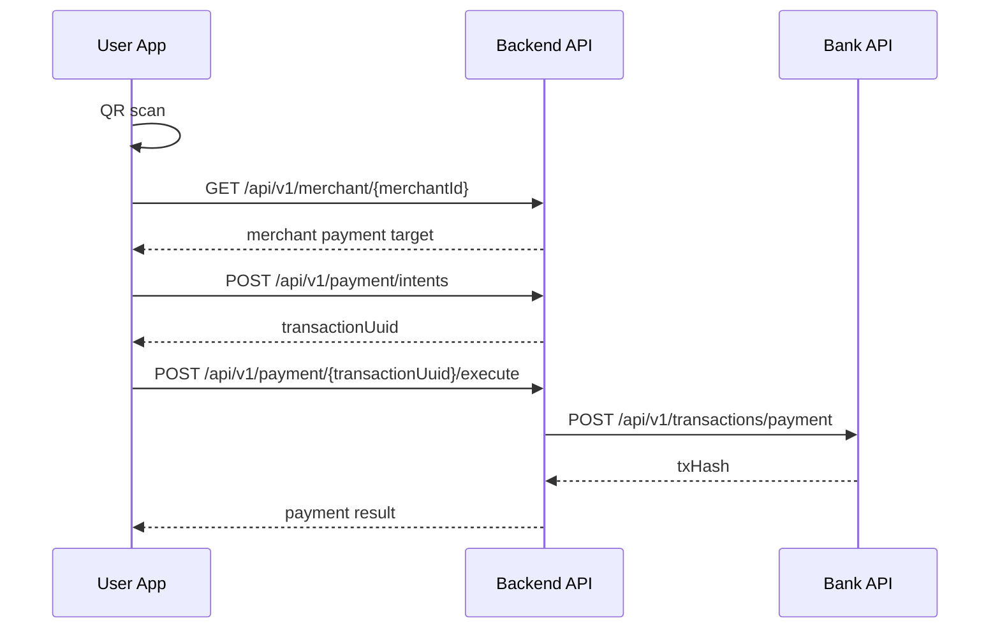

# REST API

모든 공개 API 경로 앞에는 `/api/v1` prefix를 붙인다. 아래 표의 path는 prefix를 제외한 경로다.

## Common Rules

- 인증 방식은 세션 기반이다. JWT로 변경하지 않는다.
- 로그인 성공 시 세션에 `userId` 또는 `merchantId`, 공통 `partyId`, `role`을 저장한다.
- `SessionAuthenticationFilter`는 세션 값을 Spring Security 인증 객체로 변환한다.
- 모든 응답은 공통 래퍼 `ApiResponse`를 사용한다.
- 모든 엔드포인트에는 SpringDoc `@Operation`을 작성한다.
- 엔티티를 API 응답으로 직접 반환하지 않는다.

공통 응답:

```json
{
  "isSuccess": true,
  "status": "OK",
  "code": "COMMON_OK",
  "message": "성공적으로 처리했습니다.",
  "result": {}
}
```

## Role Rules

| Role | Meaning |
| --- | --- |
| `PUBLIC` | 비로그인 가능 |
| `USER` | 소비자 세션 필요 |
| `MERCHANT` | 가맹점 세션 필요 |
| `USER | MERCHANT` | 소비자와 가맹점 모두 가능 |

현재 구현상 계좌와 충전 경로는 개발 편의를 위해 Spring Security에서 일부 `permitAll()` 상태가 남아 있다. 문서의 목표 권한은 아래 API Catalog의 `Role`을 기준으로 한다.

## Session Attributes

| Name | Meaning |
| --- | --- |
| `userId` | 소비자 자체 식별자 |
| `merchantId` | 가맹점 자체 식별자 |
| `partyId` | 공통 party 식별자 |
| `role` | `USER` 또는 `MERCHANT` |
| `signupPhoneVerified`, `signupPhoneNumber`, `signupPhoneVerifiedAt` | 회원가입용 SMS 인증 상태 |
| `signupAccountVerified`, `signupInstitutionId`, `signupAccountNumber`, `signupAccountVerifiedAt` | 회원가입용 계좌 인증 상태 |

## Implemented vs Stub

| Status | Meaning |
| --- | --- |
| `구현` | 컨트롤러/서비스 동작 구현됨 |
| `부분 구현` | 컨트롤러 또는 서비스 일부만 구현됨, 보안/경로/외부연동 정렬 필요 |
| `스텁` | 컨트롤러 클래스만 있고 엔드포인트 없음 |
| `미구현` | 문서상 목표만 있음 |

## API Catalog

| ID | Name | Method | Path | Auth | Role | Status | Notes |
| --- | --- | --- | --- | --- | --- | --- | --- |
| `AUTH-001` | SMS 인증 코드 발송 | `POST` | `/auth/sms/send` | `X` | `PUBLIC` | 구현 | 현재 응답에 테스트용 인증 코드 포함 |
| `AUTH-002` | SMS 인증 코드 검증 | `POST` | `/auth/sms/verify` | `X` | `PUBLIC` | 구현 | 회원가입용 세션 상태 저장 |
| `AUTH-003` | 계좌 1원 인증 코드 발송 | `POST` | `/auth/account/send` | `X` | `PUBLIC` | 구현 | bank 계좌 존재 확인 후 테스트용 코드 발급 |
| `AUTH-004` | 계좌 1원 인증 코드 검증 | `POST` | `/auth/account/verify` | `X` | `PUBLIC` | 구현 | 회원가입용 세션 상태 저장 |
| `AUTH-005` | 비밀번호 재설정 | - | - | - | - | 미구현 | |
| `LOGIN-001` | 소비자 로그인 | `POST` | `/auth/users/login` | `X` | `PUBLIC` | 구현 | 세션 생성 |
| `LOGIN-002` | 가맹점 로그인 | `POST` | `/auth/merchants/login` | `X` | `PUBLIC` | 구현 | 세션 생성. 요청 필드명은 현재 `phoneNumber` |
| `LOGOUT-001` | 로그아웃 | `POST` | `/auth/logout` | `O` | `USER | MERCHANT` | 구현 | 현재 세션 삭제 |
| `REG-001` | 소비자 회원가입 | `POST` | `/auth/users/register` | `X` | `PUBLIC` | 구현 | 휴대폰·계좌 인증 세션 확인 후 party/user/primary account/wallet 생성 |
| `REG-002` | 사업자 정보 조회 | `GET` | `/merchant/business-info` | `X` | `PUBLIC` | 구현 | 쿼리 파라미터: `businessNumber` |
| `REG-003` | 가맹점 회원가입 | - | - | - | - | 미구현 | `MerchantRegisterRequest`는 비어 있음 |
| `ACCOUNT-001` | 등록 계좌 목록 조회 | `GET` | `/accounts` | `O` | `USER | MERCHANT` | 부분 구현 | 현재 임시 `partyId` query parameter 사용 |
| `ACCOUNT-002` | 계좌 추가 | `POST` | `/accounts` | `O` | `USER | MERCHANT` | 부분 구현 | 현재 임시 `partyId` query parameter 사용 |
| `ACCOUNT-003` | 계좌 삭제 | `DELETE` | `/accounts/{accountId}` | `O` | `USER | MERCHANT` | 부분 구현 | 현재 임시 `partyId` query parameter 사용 |
| `ACCOUNT-004` | 주거래 계좌 변경 | `PATCH` | `/accounts/{accountId}/primary` | `O` | `USER | MERCHANT` | 부분 구현 | 현재 임시 `partyId` query parameter 사용 |
| `PAY-001` | QR 가맹점 정보 조회 | `GET` | `/merchant/{merchantId}` | `O` | `USER` | 구현 | QR payload의 merchant 자체 id 기준 |
| `PAY-002` | 결제 의도 생성 | `POST` | `/payment/intents` | `O` | `USER` | 구현 | 세션 `partyId` 기준. 서버가 `transactionUuid` 발급 |
| `PAY-003` | 결제 실행 | `POST` | `/payment/{transactionUuid}/execute` | `O` | `USER` | 구현 | 세션 `userId`, `partyId` 기준. Bank 호출 전 Redis lock/idempotency 적용 |
| `PAY-004` | 결제 상태 복구 | `POST` | `/payment/{transactionUuid}/recover` | `O` | `USER` | 구현 | `UNKNOWN`/`PROCESSING` 결제를 Bank 조회로 재동기화 |
| `CHARGE-001` | 충전 정보 조회 | - | `/charge` | `O` | `USER` | 스텁 | `ChargeController` 엔드포인트 없음 |
| `CHARGE-002` | 충전 실행 | - | `/charge` | `O` | `USER` | 스텁 | `ChargeController` 엔드포인트 없음 |
| `EXCHANGE-001` | 환전 정보 조회 | - | `/exchange` | `O` | `USER | MERCHANT` | 스텁 | `ExchangeController` 엔드포인트 없음 |
| `EXCHANGE-002` | 환전 실행 | - | `/exchange` | `O` | `USER | MERCHANT` | 스텁 | `ExchangeController` 엔드포인트 없음 |
| `MERCHANT-001` | 가맹점 매출 요약 조회 | - | - | `O` | `MERCHANT` | 미구현 | DTO만 존재 |
| `MERCHANT-002` | 가맹점 결제 내역 조회 | - | - | `O` | `MERCHANT` | 미구현 | DTO만 존재 |
| `MERCHANT-003` | 가맹점 결제 상세 조회 | - | - | `O` | `MERCHANT` | 미구현 | |
| `MERCHANT-004` | 결제 취소 | - | - | `O` | `MERCHANT` | 미구현 | |
| `MERCHANT-005` | 가맹점 정산 내역 조회 | - | - | `O` | `MERCHANT` | 미구현 | 별도 정산 테이블 없음. 목표는 `transaction`의 가맹점 `EXCHANGE` 조회 |
| `MERCHANT-006` | 가맹점 정산 신청 조회 | - | - | `O` | `MERCHANT` | 미구현 | 서비스 용어는 환전으로 정렬 예정 |
| `MERCHANT-007` | 가맹점 정산 신청 실행 | - | - | `O` | `MERCHANT` | 미구현 | 서비스 용어는 환전으로 정렬 예정 |
| `MERCHANT-008` | 가맹점 QR 조회 | `GET` | `/merchant/qr` | `O` | `MERCHANT` | 구현 | PNG data URL base64 반환 |
| `MERCHANT-009` | 가맹점 마이페이지 조회 | `GET` | `/merchant/mypage` | `O` | `MERCHANT` | 구현 | 세션 `partyId` 기준 |
| `MERCHANT-010` | 가맹점 계좌 변경 | `PATCH` | `/merchant/accounts` | `O` | `MERCHANT` | 구현 | `SETTLEMENT` 계좌 upsert |
| `MY-001` | 사용자 프로필 조회 | `GET` | `/users/profile` | `O` | `USER` | 구현 | 세션 `userId` 기준 |
| `MY-002` | 사용자 내역 조회 | `GET` | `/users/histories` | `O` | `USER` | 구현 | `historyType`, `size`, `cursorCreatedAt`, `cursorId` |
| `MY-003` | 사용자 내역 상세 조회 | `GET` | `/users/histories/{historyId}` | `O` | `USER` | 구현 | `type=PAYMENT|CANCEL|CHARGE|EXCHANGE` |
| `WALLET-001` | 잔액 조회 | - | `/wallet` | `O` | `USER | MERCHANT` | 스텁 | `WalletController` 엔드포인트 없음 |
| `WALLET-002` | 근처 가맹점 조회 | - | - | `O` | `USER` | 보류 | 구현 복잡도 |

## Request DTO Summary

### Login

```json
{
  "phoneNumber": "01012345678",
  "password": "password"
}
```

### User Register

```json
{
  "name": "홍길동",
  "birthDate": "1990-01-01",
  "phoneNumber": "01012345678",
  "password": "password",
  "paymentPin": "123456",
  "institutionId": 1,
  "accountNumber": "1234567890",
  "termsAgreed": {
    "serviceTerms": true,
    "privacyTerms": true,
    "electronicFinanceTerms": true,
    "localCurrencyTerms": true
  }
}
```

### Account Add

```json
{
  "institutionCode": "088",
  "accountNumber": "9876543210"
}
```

### Merchant Settlement Account Update

```json
{
  "institutionCode": "088",
  "accountNumber": "9876543210"
}
```

## Payment Flow

QR에는 `merchantId`가 들어 있다. 소비자가 QR을 스캔하면 서버에서 신뢰 가능한 가맹점 정보를 조회하고, 금액 입력 화면으로 전환한다. 결제는 서버가 발급한 `transactionUuid` 기반의 2단계 흐름으로 처리한다.



## Settlement and Exchange

정산은 별도 정산 테이블이 아니라 가맹점이 보유한 토큰을 계좌로 환전 신청한 `transaction` 기록으로 본다.

목표 조회 대상:

- `transaction.from_party_id = 현재 가맹점 partyId`
- `transaction.transaction_type = EXCHANGE`

서비스 용어는 `exchange`와 `환전`을 우선한다. 화면 문맥상 `정산 내역`이라는 표현이 필요하면 transaction 기반 환전 내역으로 설명한다.
